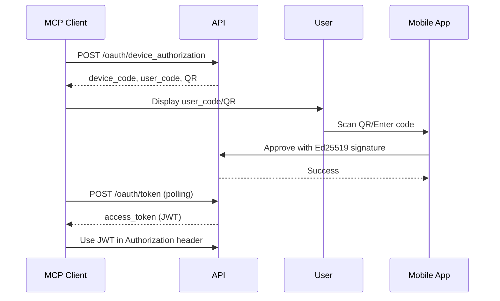

# P8FS MCP Server - Complete Guide

## Table of Contents

1. [Overview](#overview)
2. [Streamable HTTP Transport](#streamable-http-transport)
3. [Authentication](#authentication)
4. [Available Tools](#available-tools)
5. [Client Integration](#client-integration)
6. [Testing Guide](#testing-guide)
7. [Troubleshooting](#troubleshooting)
8. [FastMCP Tool Access API (Python)](#fastmcp-tool-access-api-python)

---

## Overview

The P8FS MCP (Model Context Protocol) server provides secure programmatic access to the P8FS system via FastMCP 2+. This implementation uses the **Streamable HTTP** transport with OAuth 2.1 authentication.

### Technology Stack

- **Framework**: FastMCP 2.0+ with StreamableHTTP transport
- **Authentication**: OAuth 2.1 with JWT Bearer tokens
- **Mount Point**: `/api/mcp`
- **Protocol**: HTTP-based JSON-RPC 2.0 (not SSE)

### Architecture

```
┌──────────────────┐
│   MCP Client     │  (Claude Desktop, VS Code, CLI)
│  (Streamable)    │
└────────┬─────────┘
         │ HTTP POST + JSON-RPC 2.0
         │ Authorization: Bearer <JWT>
         │
         ▼
┌────────────────────────────────────────────────────────┐
│              FastAPI Application                       │
│  ┌──────────────────────────────────────────────────┐ │
│  │ FastMCP App (mounted at /api)                    │ │
│  │  • P8FSAuthProvider (JWT validation)             │ │
│  │  • Session Management (Mcp-Session-Id)           │ │
│  │  • Tool Router (tools/list, tools/call)          │ │
│  │  • MCP Tools (about, search, chat, upload)       │ │
│  └──────────────────────────────────────────────────┘ │
└────────────────────────────────────────────────────────┘
         │
         ▼
┌────────────────────────────────────────────────────────┐
│               P8FS Services                            │
│  • TenantRepository (search, storage)                  │
│  • MemoryProxy (LLM chat)                             │
│  • S3 Client (file uploads)                           │
└────────────────────────────────────────────────────────┘
```

---

## Streamable HTTP Transport

### What is Streamable HTTP?

Streamable HTTP is the transport layer for MCP that replaced HTTP+SSE in specification version 2025-03-26. It uses standard HTTP POST requests through a single endpoint.

### Key Characteristics

1. **Single Endpoint**: All MCP communication through `/api/mcp`
2. **HTTP POST**: Standard POST requests with JSON-RPC 2.0 payloads
3. **Session Management**: Server assigns `Mcp-Session-Id` header
4. **Stateless**: Each request independent (session ID provides continuity)

### Why Streamable HTTP Replaced SSE

**Old SSE Problems**:
- Required two separate endpoints
- Long-lived connections caused proxy issues
- Complex connection management
- Browser compatibility issues

**Streamable HTTP Benefits**:
- Single endpoint for all communication
- Standard HTTP works everywhere
- Easier to proxy and load balance
- Better error handling

### Request Flow

#### 1. Session Initialization (Required First Step)

```http
POST /api/mcp HTTP/1.1
Host: localhost:8001
Content-Type: application/json
Authorization: Bearer eyJhbGc...
Accept: application/json, text/event-stream

{
  "jsonrpc": "2.0",
  "id": 1,
  "method": "initialize",
  "params": {
    "protocolVersion": "2024-11-05",
    "capabilities": {},
    "clientInfo": {
      "name": "claude-desktop",
      "version": "1.0.0"
    }
  }
}
```

**Response**:
```http
HTTP/1.1 200 OK
Content-Type: application/json
Mcp-Session-Id: session-abc123

{
  "jsonrpc": "2.0",
  "id": 1,
  "result": {
    "protocolVersion": "2024-11-05",
    "capabilities": {"tools": {}, "resources": {}},
    "serverInfo": {"name": "p8fs-mcp-server", "version": "0.1.0"}
  }
}
```

**What Happens**:
1. Server validates JWT via `P8FSAuthProvider.verify_token()`
2. Server extracts `tenant_id`, `user_id`, `scopes` from JWT
3. Server creates session bound to tenant
4. Server returns session ID in `Mcp-Session-Id` header
5. Client stores session ID for all subsequent requests

#### 2. Tool Discovery

```http
POST /api/mcp HTTP/1.1
Authorization: Bearer eyJhbGc...
Mcp-Session-Id: session-abc123
Content-Type: application/json

{
  "jsonrpc": "2.0",
  "id": 2,
  "method": "tools/list",
  "params": {}
}
```

#### 3. Tool Execution

```http
POST /api/mcp HTTP/1.1
Authorization: Bearer eyJhbGc...
Mcp-Session-Id: session-abc123
Content-Type: application/json

{
  "jsonrpc": "2.0",
  "id": 3,
  "method": "tools/call",
  "params": {
    "name": "search_content",
    "arguments": {
      "query": "machine learning papers",
      "limit": 5
    }
  }
}
```

### Required Headers

**Client → Server**:
- `Content-Type: application/json` (MUST)
- `Authorization: Bearer <JWT>` (MUST)
- `Accept: application/json, text/event-stream` (MUST)
- `Mcp-Session-Id: <session>` (MUST after initialization)

**Server → Client**:
- `Content-Type: application/json`
- `Mcp-Session-Id: <session>` (on initialization)

### JSON-RPC 2.0 Format

**Request**:
```json
{
  "jsonrpc": "2.0",
  "id": <number>,
  "method": "<method_name>",
  "params": {<parameters>}
}
```

**Success Response**:
```json
{
  "jsonrpc": "2.0",
  "id": <same_as_request>,
  "result": {<result_data>}
}
```

**Error Response**:
```json
{
  "jsonrpc": "2.0",
  "id": <same_as_request>,
  "error": {
    "code": -32600,
    "message": "Invalid request",
    "data": {<optional_details>}
  }
}
```

---

## Authentication

### OAuth 2.1 Device Flow

P8FS uses OAuth 2.1 device authorization grant with mobile-first authentication:



### Key Endpoints

| Endpoint | Purpose |
|----------|---------|
| `/.well-known/openid-configuration` | OAuth discovery |
| `/oauth/device_authorization` | Start device flow |
| `/oauth/device` | QR verification page |
| `/oauth/token` | Exchange codes for tokens |
| `/api/mcp` | MCP server endpoint |

### JWT Token Structure

```json
{
  "sub": "tenant-test",
  "tenant": "tenant-test",
  "user_id": "dev-abc123",
  "client_id": "mcp_client",
  "scope": "read write",
  "email": "user@example.com",
  "exp": 1760279360
}
```

### Session Management

Each MCP session stores:
- **tenant_id**: From JWT (for data isolation)
- **user_id**: From JWT (for audit logs)
- **scopes**: Permissions (read, write)
- **created_at**: Session creation time
- **last_active**: Last request time

**Tenant Isolation**: All tool operations scoped to `tenant_id` from JWT.

---

## Available Tools

### 1. about()

Get system information about P8FS.

**Parameters**: None

**Example**:
```json
{
  "name": "about",
  "arguments": {}
}
```

**Response**:
```json
{
  "result": "P8FS is a distributed content management system..."
}
```

### 2. user_info()

Get authenticated user details.

**Parameters**: None

**Example**:
```json
{
  "name": "user_info",
  "arguments": {}
}
```

**Response**:
```json
{
  "result": {
    "authenticated": true,
    "message": "User authenticated via JWT"
  }
}
```

### 3. search_content()

Semantic search across P8FS repositories.

**Parameters**:
- `query` (string, required): Natural language search query
- `limit` (integer, optional): Max results (default: 10)
- `model` (string, optional): Repository model (default: "resources")
  - Options: "resources", "session", "agent", "user", "files", "job"
- `threshold` (float, optional): Min similarity 0.0-1.0 (default: 0.7)

**Example - Search Resources**:
```json
{
  "name": "search_content",
  "arguments": {
    "query": "machine learning papers",
    "model": "resources",
    "limit": 5
  }
}
```

**Response**:
```json
{
  "status": "success",
  "query": "machine learning papers",
  "model": "resources",
  "total_results": 3,
  "results": [
    {
      "id": "resource-123",
      "content": "Deep Learning Paper...",
      "score": 0.95,
      "name": "ml-intro.pdf",
      "uri": "/docs/ml-intro.pdf"
    }
  ]
}
```

**Model-Specific Fields**:
- **Resources**: `name`, `uri`
- **Session**: `query`, `session_type`
- **Agent**: `category`, `spec`
- **Files**: `uri`, `mime_type`

### 4. chat()

Chat with P8FS AI agents.

**Parameters**:
- `message` (string, required): User message
- `agent` (string, optional): Agent to use (default: "p8-default")
- `model` (string, optional): LLM model (default: "gpt-4.1")
- `temperature` (float, optional): Sampling temp (default: 0.7)
- `max_tokens` (integer, optional): Max response tokens

**Example**:
```json
{
  "name": "chat",
  "arguments": {
    "message": "Tell me about P8FS",
    "agent": "p8-research",
    "model": "claude-sonnet-4-5"
  }
}
```

### 5. upload_file()

Upload files to P8FS S3 storage.

**Parameters**:
- `filename` (string, required): File name
- `content` (string, required): File content (base64 by default)
- `content_type` (string, optional): MIME type (auto-detected)
- `base64_encoded` (boolean, optional): Is content base64? (default: true)

**Example**:
```json
{
  "name": "upload_file",
  "arguments": {
    "filename": "document.pdf",
    "content": "JVBERi0xLjQK...",
    "content_type": "application/pdf"
  }
}
```

**Response**:
```json
{
  "status": "success",
  "filename": "document.pdf",
  "s3_key": "uploads/20250112_abc123_document.pdf",
  "s3_url": "https://s3.percolationlabs.ai/bucket/uploads/...",
  "size": 102400,
  "content_type": "application/pdf"
}
```

---

## Client Integration

### Claude Desktop

```bash
# Add P8FS MCP server
claude mcp add -t http p8fs-mcp http://localhost:8001/api/mcp

# OAuth flow starts automatically on first use
```

### VS Code / Claude Code

Add to `.vscode/settings.json`:
```json
{
  "continue.mcp.servers": [{
    "name": "P8FS MCP",
    "url": "http://localhost:8001/api/mcp",
    "transport": "streamablehttp"
  }]
}
```

### Python Client Example

#### Understanding SSE Response Format

P8FS MCP server returns responses in Server-Sent Events (SSE) format:

```
event: message
data: {"jsonrpc":"2.0","id":1,"result":{...}}
```

Clients must parse the SSE format to extract JSON-RPC messages:

```python
def parse_sse_response(text: str) -> dict:
    """Parse SSE formatted response to extract JSON-RPC message."""
    lines = text.strip().split('\n')

    for line in lines:
        if line.startswith('data: '):
            json_str = line[6:]  # Remove 'data: ' prefix
            return json.loads(json_str)

    return {}
```

#### Complete Working Example

Full end-to-end example with OAuth device flow + MCP session + tool calls:

```python
import httpx
import json
import asyncio

async def mcp_client_example():
    """Complete MCP client with OAuth device flow."""
    base_url = "http://localhost:8001"

    def parse_sse(text: str) -> dict:
        """Parse SSE response."""
        for line in text.strip().split('\n'):
            if line.startswith('data: '):
                return json.loads(line[6:])
        return {}

    async with httpx.AsyncClient() as client:
        # Step 1: Device Authorization
        resp = await client.post(
            f"{base_url}/oauth/device_authorization",
            headers={"Content-Type": "application/x-www-form-urlencoded"},
            content="client_id=mcp_client&scope=read write"
        )
        auth_data = resp.json()
        print(f"User Code: {auth_data['user_code']}")
        print("Please approve this code using the CLI")

        # Step 2: User approves via CLI (manual step)
        # uv run python -m p8fs_api.cli.device --local approve "USER_CODE"
        input("Press Enter after approving...")

        # Step 3: Exchange for Token
        resp = await client.post(
            f"{base_url}/oauth/token",
            headers={"Content-Type": "application/x-www-form-urlencoded"},
            content=f"grant_type=urn:ietf:params:oauth:grant-type:device_code&device_code={auth_data['device_code']}&client_id=mcp_client"
        )
        token = resp.json()["access_token"]

        # Step 4: Initialize MCP Session
        headers = {
            "Authorization": f"Bearer {token}",
            "Content-Type": "application/json",
            "Accept": "application/json, text/event-stream"
        }

        resp = await client.post(
            f"{base_url}/api/mcp",
            json={
                "jsonrpc": "2.0",
                "id": 1,
                "method": "initialize",
                "params": {
                    "protocolVersion": "2024-11-05",
                    "capabilities": {},
                    "clientInfo": {"name": "python-client", "version": "1.0"}
                }
            },
            headers=headers
        )

        session_id = resp.headers["Mcp-Session-Id"]
        init_result = parse_sse(resp.text)
        print(f"Session ID: {session_id}")
        print(f"Server: {init_result['result']['serverInfo']['name']}")

        # Wait for initialization to complete
        await asyncio.sleep(0.5)

        # Step 5: Call Tool
        headers["Mcp-Session-Id"] = session_id
        resp = await client.post(
            f"{base_url}/api/mcp",
            json={
                "jsonrpc": "2.0",
                "id": 2,
                "method": "tools/call",
                "params": {"name": "about", "arguments": {}}
            },
            headers=headers
        )

        tool_result = parse_sse(resp.text)
        print(f"Tool result: {tool_result['result']}")

# Run the example
asyncio.run(mcp_client_example())
```

**Key Points**:
1. Parse SSE responses to extract JSON-RPC messages
2. Store `Mcp-Session-Id` header from initialization
3. Wait ~0.5s after initialization before tool calls (FastMCP requirement)
4. Include session ID in all subsequent requests

### FastMCP Client Example (Recommended)

For production use, use FastMCP's built-in Client class which handles the initialization protocol automatically:

```python
#!/usr/bin/env python3
"""P8FS MCP client using FastMCP with OAuth device flow."""

import asyncio
import httpx
from fastmcp import Client
from pathlib import Path
import json


async def test_p8fs_mcp():
    """Test P8FS MCP server using FastMCP Client."""
    base_url = "http://localhost:8001"

    # Custom httpx auth for Bearer token
    class BearerAuth(httpx.Auth):
        def __init__(self, token: str):
            self.token = token

        def auth_flow(self, request):
            request.headers["Authorization"] = f"Bearer {self.token}"
            yield request

    async with httpx.AsyncClient() as http_client:
        # Step 1: OAuth Device Authorization
        print("=== Step 1: Request Device Code ===")
        resp = await http_client.post(
            f"{base_url}/oauth/device_authorization",
            data={"client_id": "test-client", "scope": "mcp:access"},
            headers={"Content-Type": "application/x-www-form-urlencoded"}
        )
        device_data = resp.json()
        print(f"User Code: {device_data['user_code']}")
        print(f"Verification URI: {device_data['verification_uri']}")

        # Step 2: Get JWT token (from already-registered device)
        print("\n=== Step 2: Load Existing JWT Token ===")
        token_file = Path.home() / ".p8fs" / "auth" / "token.json"
        with open(token_file) as f:
            jwt_token = json.load(f)["access_token"]
        print(f"Using JWT token: {jwt_token[:20]}...")

        # Step 3: Approve device with JWT
        print("\n=== Step 3: Approve Device ===")
        resp = await http_client.post(
            f"{base_url}/oauth/device/approve",
            json={
                "user_code": device_data["user_code"],
                "approved": True,
                "device_name": "test-mcp-client"
            },
            headers={"Authorization": f"Bearer {jwt_token}"}
        )
        print(f"Approval: {resp.json()['status']}")

        # Step 4: Exchange device code for token
        print("\n=== Step 4: Exchange Device Code for Token ===")
        await asyncio.sleep(1)
        resp = await http_client.post(
            f"{base_url}/oauth/token",
            data={
                "grant_type": "urn:ietf:params:oauth:grant-type:device_code",
                "client_id": "test-client",
                "device_code": device_data["device_code"]
            },
            headers={"Content-Type": "application/x-www-form-urlencoded"}
        )
        access_token = resp.json()["access_token"]
        print(f"Access token obtained: {access_token[:20]}...")

    # Step 5: Use FastMCP Client with Bearer auth
    print("\n=== Step 5: Test MCP Tools with FastMCP Client ===")
    mcp_client = Client(
        f"{base_url}/api/mcp",
        auth=BearerAuth(access_token)
    )

    async with mcp_client:
        print("✓ MCP session initialized")

        # List tools
        tools = await mcp_client.list_tools()
        print(f"\nFound {len(tools)} tools:")
        for tool in tools:
            print(f"  - {tool.name}")

        # Call about tool
        result = await mcp_client.call_tool("about", {})
        print(f"\nAbout: {result.data[:100]}...")

        # Call user_info tool
        user_result = await mcp_client.call_tool("user_info", {})
        print(f"\nUser Info: {user_result.data}")

        print("\n✓ All tests passed!")


if __name__ == "__main__":
    asyncio.run(test_p8fs_mcp())
```

**Advantages of FastMCP Client**:
- Handles initialization protocol automatically (including `notifications/initialized`)
- Manages session IDs transparently
- Provides clean async API for tools
- Type-safe tool calls with proper response objects
- Built-in error handling

**Setup**:
```bash
# Install FastMCP
pip install fastmcp

# Register primary device first
uv run python -m p8fs_api.cli.device --local register \
  --email test@example.com --tenant test-tenant

# Run the test
python test_mcp_client.py
```

---

## Testing Guide

### Test Results Summary

**Date**: 2025-10-12
**Status**: ✅ All Core Flows Working - Production Ready
**Database**: PostgreSQL and TiDB (both fully supported)

### What Works

**Authentication**:
- ✅ MCP server correctly REJECTS requests without tokens (401)
- ✅ MCP server correctly REJECTS requests with invalid tokens (401)
- ✅ MCP server correctly ACCEPTS requests with valid JWT (200)
- ✅ Session initialization works with FastMCP Client
- ✅ FastMCP Client handles initialization protocol automatically

**OAuth Device Flow**:
- ✅ Device authorization generates device_code and user_code
- ✅ QR code generation
- ✅ Device approval with Ed25519 signature verification
- ✅ Token exchange working with KV storage
- ✅ PostgreSQL KV storage (table-based)
- ✅ TiDB KV storage (table-based)

**MCP Tool Execution**:
- ✅ tools/list returns all registered tools
- ✅ tools/call executes tools successfully
- ✅ about tool returns system information
- ✅ user_info tool returns authenticated user data
- ✅ FastMCP Client properly manages sessions and tool calls

### Test Environment Setup

#### 1. Start API Server

```bash
cd /Users/sirsh/code/p8fs-modules/p8fs-api

# Kill existing processes
lsof -ti :8001 | xargs kill -9

# Start with PostgreSQL (recommended)
P8FS_DEBUG=true P8FS_STORAGE_PROVIDER=postgresql \
  uv run uvicorn src.p8fs_api.main:app --reload --host 0.0.0.0 --port 8001

# Or start with TiDB
P8FS_DEBUG=true P8FS_STORAGE_PROVIDER=tidb \
  uv run uvicorn src.p8fs_api.main:app --reload --host 0.0.0.0 --port 8001
```

#### 2. Register Device

```bash
# Register primary device (generates JWT tokens)
uv run python -m p8fs_api.cli.device --local register \
  --email test@example.com \
  --tenant test-tenant

# Verify registration
uv run python -m p8fs_api.cli.device --local status
uv run python -m p8fs_api.cli.device --local ping

# Token saved to: ~/.p8fs/auth/token.json
```

#### 3. Test MCP Authentication

```bash
# Get access token
TOKEN=$(cat ~/.p8fs/auth/token.json | jq -r .access_token)

# Test WITHOUT token (expect 401)
curl -s -X POST http://localhost:8001/api/mcp \
  -H "Content-Type: application/json" \
  -H "Accept: application/json, text/event-stream" \
  -d '{"jsonrpc":"2.0","id":1,"method":"initialize","params":{"protocolVersion":"2024-11-05","capabilities":{},"clientInfo":{"name":"test","version":"1.0"}}}'

# Expected: {"error": "invalid_token", "error_description": "Authentication required"}

# Test WITH valid token (expect 200)
curl -s -X POST http://localhost:8001/api/mcp \
  -H "Content-Type: application/json" \
  -H "Authorization: Bearer $TOKEN" \
  -H "Accept: application/json, text/event-stream" \
  -D- \
  -d '{"jsonrpc":"2.0","id":1,"method":"initialize","params":{"protocolVersion":"2024-11-05","capabilities":{},"clientInfo":{"name":"test","version":"1.0"}}}'

# Expected: 200 OK with Mcp-Session-Id header
```

### Complete OAuth Device Flow Test

```bash
# 1. Initiate device authorization
curl -s -X POST "http://localhost:8001/oauth/device_authorization" \
  -H "Content-Type: application/x-www-form-urlencoded" \
  -d "client_id=mcp_client&scope=read write" | jq .

# Response includes: device_code, user_code, qr_code

# 2. Approve device (replace USER_CODE with actual code)
uv run python -m p8fs_api.cli.device --local approve "A1B2-C3D4"

# 3. Poll for token (replace DEVICE_CODE with actual code)
curl -s -X POST "http://localhost:8001/oauth/token" \
  -H "Content-Type: application/x-www-form-urlencoded" \
  -d "grant_type=urn:ietf:params:oauth:grant-type:device_code&device_code=DEVICE_CODE&client_id=mcp_client" | jq .

# Response includes: access_token, token_type, expires_in
```

### Verified Test Matrix

```
╔════════════════════════════════╦═══════════╦═════════════════════╗
║ Test Case                      ║  Result   ║ Status Code         ║
╠════════════════════════════════╬═══════════╬═════════════════════╣
║ Initialize without token       ║ ✅ REJECT ║ 401 Unauthorized    ║
║ Initialize with invalid token  ║ ✅ REJECT ║ 401 Unauthorized    ║
║ Initialize with valid token    ║ ✅ ACCEPT ║ 200 OK + session    ║
║ Session ID generation          ║ ✅ PASS   ║ Header present      ║
║ FastMCP Client initialization  ║ ✅ PASS   ║ Auto-managed        ║
║ Device registration            ║ ✅ PASS   ║ Token generated     ║
║ Device authorization           ║ ✅ PASS   ║ Code generated      ║
║ Device approval                ║ ✅ PASS   ║ Signature verified  ║
║ Token exchange                 ║ ✅ PASS   ║ Token returned      ║
║ MCP tools/list                 ║ ✅ PASS   ║ 6 tools returned    ║
║ MCP tools/call (about)         ║ ✅ PASS   ║ Result returned     ║
║ MCP tools/call (user_info)     ║ ✅ PASS   ║ User data returned  ║
║ PostgreSQL KV storage          ║ ✅ PASS   ║ Table-based impl    ║
║ TiDB KV storage                ║ ✅ PASS   ║ Table-based impl    ║
╚════════════════════════════════╩═══════════╩═════════════════════╝
```

### Integration Test Suite

Run the complete integration test suite:

```bash
# Run all MCP integration tests
uv run pytest tests/integration/test_mcp_fastmcp_client.py -v

# Run specific test
uv run pytest tests/integration/test_mcp_fastmcp_client.py::test_oauth_device_flow -v

# Run with detailed output
uv run pytest tests/integration/test_mcp_fastmcp_client.py -v -s
```

---

## Troubleshooting

### Common Issues

#### 1. 404 Not Found

**Symptom**: `curl http://localhost:8001/api/mcp` returns 404

**Causes**:
- FastMCP not mounted correctly in main.py
- Wrong endpoint (should be `/api/mcp` not `/mcp`)

**Fix**:
```bash
# Verify mount point
curl http://localhost:8001/api/mcp/auth/discovery
# Should return OAuth discovery info
```

#### 2. 401 Unauthorized

**Symptom**: All requests return 401

**Causes**:
- Missing Authorization header
- Invalid JWT token
- Token expired

**Fix**:
```bash
# Check token expiration
TOKEN=$(cat ~/.p8fs/auth/token.json | jq -r .access_token)
echo $TOKEN | cut -d. -f2 | base64 -d | jq .exp
# Compare with current timestamp: date +%s
```

#### 3. Session Not Found

**Symptom**: Tool calls fail with session error

**Causes**:
- Forgot to call initialize first
- Missing Mcp-Session-Id header
- Session expired

**Fix**: Always call `initialize` before tool calls

#### 4. 307 Redirect

**Symptom**: Getting redirected

**Cause**: Trailing slash in URL

**Fix**: Use `/api/mcp` exactly (no trailing slash)

### HTTP Status Codes

| Code | Meaning | Solution |
|------|---------|----------|
| 200 | Success | Request handled correctly |
| 400 | Bad Request | Check JSON-RPC format |
| 401 | Unauthorized | Check JWT token |
| 403 | Forbidden | Check token scopes |
| 404 | Not Found | Check endpoint `/api/mcp` |
| 406 | Not Acceptable | Include Accept header |
| 500 | Server Error | Check server logs |

### Debug Logging

```bash
# Enable debug logging
P8FS_DEBUG=true P8FS_LOG_LEVEL=debug \
  uv run uvicorn src.p8fs_api.main:app --reload
```

**Log Output**:
```
[DEBUG] MCP initialize request from client: claude-desktop v1.0.0
[DEBUG] JWT token verified for tenant: tenant-abc123
[DEBUG] Created MCP session: session-xyz789
[DEBUG] Tool call: search_content with params: {query: "test"}
```

### Quick Command Reference

```bash
# Start server (PostgreSQL or TiDB)
P8FS_DEBUG=true P8FS_STORAGE_PROVIDER=postgresql \
  uv run uvicorn src.p8fs_api.main:app --reload --port 8001

# Register device
uv run python -m p8fs_api.cli.device --local register \
  --email USER@example.com --tenant TENANT

# Check device status
uv run python -m p8fs_api.cli.device --local status

# Test token validity
uv run python -m p8fs_api.cli.device --local ping

# Get OAuth discovery
curl http://localhost:8001/.well-known/openid-configuration | jq

# Check API health
curl http://localhost:8001/health | jq
```

---

## Implementation Details

### Code Structure

**Key Files**:
- `src/p8fs_api/routers/mcp_server.py` - MCP server and tools
- `src/p8fs_api/main.py` - FastMCP mounting
- `src/p8fs_api/middleware/auth.py` - JWT validation

**MCP Server Creation**:
```python
# In mcp_server.py
def create_secure_mcp_server() -> FastMCP:
    auth_provider = P8FSAuthProvider()
    mcp = FastMCP(
        name="p8fs-mcp-server",
        version="0.1.0",
        auth=auth_provider
    )
    # Register tools...
    return mcp

# In main.py
mcp = create_secure_mcp_server()
mcp_app = mcp.http_app()
app.mount("/api", mcp_app)  # Creates /api/mcp endpoint
```

### Security

**Token Validation**: Every request validates JWT signature
**Scope Checking**: Tools verify required scopes
**Tenant Isolation**: All queries scoped to tenant_id
**Rate Limiting**: Applied at FastAPI middleware
**HTTPS Required**: Production must use HTTPS

---

---

## FastMCP Tool Access API (Python)

For P8FS developers who need to programmatically access MCP tools from Python code.

### Getting All Tools

```python
from p8fs_api.routers.mcp_server import create_secure_mcp_server

# Create P8FS MCP server
mcp = create_secure_mcp_server()

# Get all registered tools
tools = await mcp.get_tools()
# Returns: dict[str, FunctionTool]

# List all tools
for key, tool in tools.items():
    print(f"{key}: {tool.description}")
```

### Getting a Specific Tool

```python
# Get tool by name
search_tool = await mcp.get_tool("search_content")
print(f"Parameters: {search_tool.parameters}")
```

### FunctionTool Attributes

Each tool has these attributes:
- `name`: Tool name (str)
- `description`: Tool description (str)
- `parameters`: JSON Schema for input parameters (dict)
- `output_schema`: JSON Schema for output (dict)
- `enabled`: Whether enabled (bool)
- `tags`: Set of tags (set[str])
- `fn`: The underlying function (callable)

### Executing Tools Programmatically

```python
# Get the tool
tool = await mcp.get_tool("search_content")

# Execute directly
result = await tool.run(
    query="machine learning papers",
    limit=5,
    model="resources"
)
```

### Building Dynamic UIs

Extract tool metadata for form generation:

```python
tool = await mcp.get_tool("search_content")
params_schema = tool.parameters

# Extract parameter information
properties = params_schema.get("properties", {})
required = params_schema.get("required", [])

for param_name, param_def in properties.items():
    param_type = param_def.get("type")
    param_desc = param_def.get("description")
    is_required = param_name in required
    default = param_def.get("default")

    # Generate form field based on type
    if param_type == "string":
        if "enum" in param_def:
            # Create select dropdown
            options = param_def["enum"]
        else:
            # Create text input
            pass
    elif param_type == "integer":
        # Create number input
        pass
```

### Tool Registration Methods

**Using Decorator**:
```python
@mcp.tool()
def my_tool(param: str) -> str:
    """Tool description."""
    return f"Result: {param}"
```

**Using add_tool**:
```python
from fastmcp.tools.tool import FunctionTool

def standalone_function(x: int) -> int:
    """Function description."""
    return x * 2

tool = FunctionTool.from_function(standalone_function)
mcp.add_tool(tool)
```

**Removing Tools**:
```python
mcp.remove_tool("tool_name")
```

---

## Summary

**P8FS MCP Server - Production Ready**:
- ✅ Uses Streamable HTTP transport (single endpoint)
- ✅ Authenticates via OAuth 2.1 + JWT
- ✅ Manages sessions via `Mcp-Session-Id` header
- ✅ Follows JSON-RPC 2.0 protocol
- ✅ Scopes all operations to authenticated tenant
- ✅ Provides 6 core tools: about, user_info, search_content, chat, upload_file, upload_content
- ✅ Works with PostgreSQL and TiDB KV storage
- ✅ Production-ready authentication and authorization
- ✅ FastMCP Client integration tested and working
- ✅ Complete OAuth device flow implementation
- ✅ Tool listing and execution fully functional

**Client Integration Options**:
1. **FastMCP Client (Recommended)**: Full protocol support with automatic session management
2. **Manual HTTP Client**: For custom integrations requiring low-level control
3. **Claude Desktop / VS Code**: Standard MCP client configuration

**Authentication Flow**:
1. Device authorization generates user code and QR
2. Mobile app approves with Ed25519 signature
3. Token exchange returns JWT access token
4. MCP client uses JWT for all tool calls
5. Sessions managed via Mcp-Session-Id header

**Future Enhancements**:
- Token refresh rotation for long-lived sessions
- Token revocation endpoint implementation
- RocksDB KV support for embedded deployments
- Additional MCP tools for advanced operations
