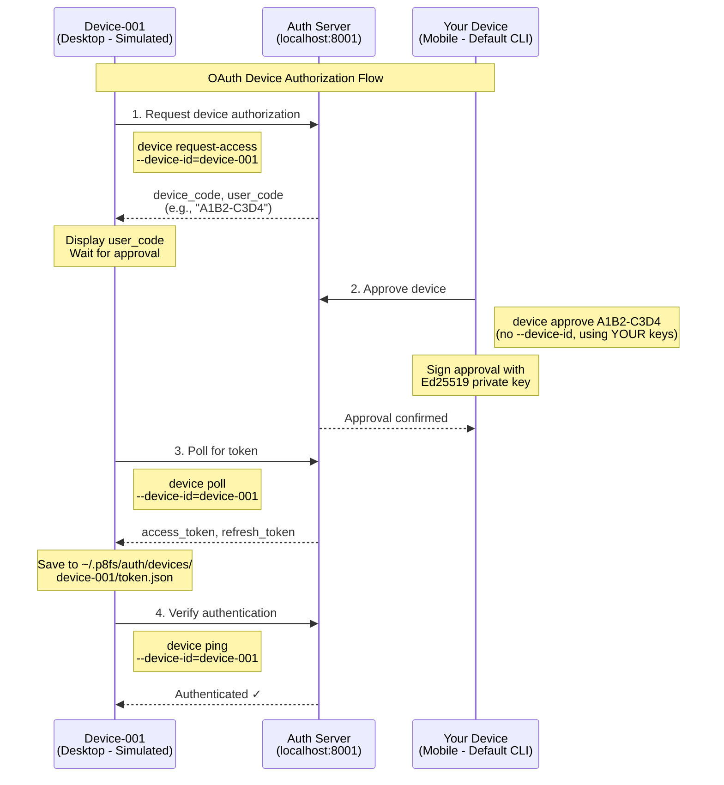

# Device Authentication Testing Guide

## Overview

This guide explains how to test the P8FS device authentication system using the device CLI. The CLI simulates a real mobile device for testing purposes, implementing the same Ed25519 keypair generation and device-bound authentication that a production mobile app would use.

## Prerequisites

### Start Database

Choose PostgreSQL (default) or TiDB for testing:

```bash
# Option 1: PostgreSQL (default)
cd /Users/sirsh/code/p8fs-modules/p8fs
docker compose up postgres -d

# Option 2: TiDB
cd /Users/sirsh/code/p8fs-modules/p8fs
docker compose up tidb -d

# Apply TiDB migrations (one-time setup for TiDB)
cd ..
uv run python -c "
import pymysql
from pathlib import Path

migration = Path('p8fs/extensions/migrations/tidb/install.sql').read_text()
conn = pymysql.connect(host='localhost', port=4000, user='root', autocommit=True)
cursor = conn.cursor()

for statement in [s.strip() for s in migration.split(';') if s.strip() and not s.strip().startswith('--')]:
    try:
        cursor.execute(statement)
    except Exception as e:
        print(f'Warning: {e}')

cursor.close()
conn.close()
print('✅ TiDB migration complete')
"
```

### Start API Server

```bash
# Kill any process on port 8001
lsof -ti :8001 | xargs kill -9

# Option 1: Start with PostgreSQL (default)
cd /Users/sirsh/code/p8fs-modules/p8fs-api
P8FS_DEBUG=true uv run uvicorn src.p8fs_api.main:app --reload --host 0.0.0.0 --port 8001

# Option 2: Start with TiDB
cd /Users/sirsh/code/p8fs-modules/p8fs-api
P8FS_DEBUG=true P8FS_STORAGE_PROVIDER=tidb uv run uvicorn src.p8fs_api.main:app --reload --host 0.0.0.0 --port 8001
```

**Verify server is running:**
```bash
curl http://localhost:8001/health
# Expected: {"status":"healthy"}
```

### Provider Comparison

| Feature | PostgreSQL | TiDB |
|---------|-----------|------|
| **Start Command** | `docker compose up postgres -d` | `docker compose up tidb -d` |
| **Port** | 5438 | 4000 |
| **ENV Variable** | (default) | `P8FS_STORAGE_PROVIDER=tidb` |
| **Protocol** | PostgreSQL | MySQL |
| **Migrations** | Automatic | Manual (see above) |
| **Use Case** | Development, testing | Production, distributed |

## Device CLI - Simulating Mobile Devices

The device CLI (`p8fs_api.cli.device`) acts as a mobile device simulator for testing. It generates Ed25519 keypairs and stores them locally, just like a real mobile app would.

### Key Storage Location

All device credentials are stored in:
```
~/.p8fs/auth/token.json
```

This file contains:
- **JWT tokens** (access_token, refresh_token)
- **Device keypair** (private_key_pem, public_key_pem, public_key_b64)
- **Device metadata** (email, tenant_id, device_id)

### Security Model

**Critical Security Principle:**
🔒 The device's **private key NEVER leaves the device**

#### What Gets Sent to Server:
1. ✅ **JWT Bearer Token** - Proves device identity (sent in `Authorization` header)
2. ✅ **Challenge** - Plaintext message that was signed (e.g., `"approve:1A09-DE7E"`)
3. ✅ **Signature** - Base64-encoded Ed25519 signature of the challenge

#### What Stays on Device:
1. 🔒 **Private Key** - Only used locally to create signatures, **NEVER transmitted**
2. 🔒 **Device Keypair** - Stored in `~/.p8fs/auth/token.json`

## Device-Bound Authentication Flow

### Registration Flow

```bash
# 1. Device generates Ed25519 keypair locally
uv run python -m p8fs_api.cli.device register --email user@example.com --tenant test-tenant
```

**What Happens:**
```python
# On Device (CLI)
private_key, public_key = generate_ed25519_keypair()  # ← Generated locally
save_to_file("~/.p8fs/auth/token.json", {
    "private_key_pem": private_key,  # ← Stays local
    "public_key_pem": public_key
})

# Send to Server
POST /api/v1/auth/dev/register
{
    "email": "user@example.com",
    "public_key": base64_encode(public_key),  # ← Only public key sent
    "device_info": {...}
}

# Server Response
{
    "access_token": "eyJ...",
    "refresh_token": "...",
    "tenant_id": "test-tenant"
}
```

### Device Approval Flow (Device-Bound Authentication)

When approving another device's authorization request:

```bash
# Another device initiates authorization
# You receive user_code: "1A09-DE7E"

# Your device approves with signature
uv run python -m p8fs_api.cli.device approve 1A09-DE7E
```

**What Happens:**
```python
# On Device (CLI) - Private key NEVER sent
private_key = load_from_file("~/.p8fs/auth/token.json")  # ← Stays local
challenge = f"approve:{user_code}"  # e.g., "approve:1A09-DE7E"
signature = private_key.sign(challenge)  # ← Signing happens locally

# Send to Server
POST /oauth/device/approve
Headers: {
    "Authorization": "Bearer <jwt_token>"  # ← JWT authentication
}
Body: {
    "user_code": "1A09-DE7E",
    "approved": true,
    "challenge": "approve:1A09-DE7E",  # ← Plaintext
    "signature": "<base64_signature>"   # ← Just signature bytes
}

# On Server - Uses public key from database
device = get_device_from_database(device_id)
public_key = device.public_key  # ← Stored during registration

# Verify signature WITHOUT needing private key
try:
    public_key.verify(signature, challenge)  # ← Asymmetric crypto magic
    # ✓ Signature valid → Device possesses private key
    approve_device_authorization(user_code)
except InvalidSignature:
    # ✗ Signature invalid → Reject
    raise AuthenticationError("Invalid device signature")
```

## Cryptographic Details

### Ed25519 Keypair Generation

The device CLI uses the same keypair generation as a real mobile app:

```python
from p8fs_auth.services.mobile_service import MobileAuthenticationService

mobile_service = MobileAuthenticationService(repository=None, jwt_manager=None)

# Generate Ed25519 keypair (32-byte keys)
private_key_bytes, public_key_bytes = mobile_service.generate_keypair()

# Returns:
# - private_key_bytes: 32 bytes (raw Ed25519 private key)
# - public_key_bytes: 32 bytes (raw Ed25519 public key)
```

**Why Ed25519?**
- Fast signature generation/verification
- Small key sizes (32 bytes each)
- Strong security (128-bit security level)
- Deterministic signatures
- Perfect for mobile devices

### Signature Verification

**On Device (Signing):**
```python
from cryptography.hazmat.primitives.asymmetric import ed25519

# Load private key from PEM
private_key = serialization.load_pem_private_key(private_key_pem, password=None)

# Create challenge
challenge = "approve:1A09-DE7E"

# Sign challenge (produces 64-byte signature)
signature = private_key.sign(challenge.encode('utf-8'))

# Encode for transmission
signature_b64 = base64.b64encode(signature).decode('utf-8')
```

**On Server (Verification):**
```python
from cryptography.hazmat.primitives.asymmetric import ed25519

# Load public key (stored during registration)
public_key_bytes = base64.b64decode(device.public_key)
public_key = ed25519.Ed25519PublicKey.from_public_bytes(public_key_bytes)

# Decode signature
signature_bytes = base64.b64decode(signature_b64)

# Verify signature
try:
    public_key.verify(signature_bytes, challenge.encode('utf-8'))
    # ✓ Valid - device possesses private key
except InvalidSignature:
    # ✗ Invalid - reject request
```

## Testing Scenarios

### Scenario 1: Basic Device Registration

```bash
# Register a device (simulates mobile app first-time setup)
cd p8fs-api
uv run python -m p8fs_api.cli.device --local register \
  --email developer@example.com \
  --tenant test-tenant

# Output:
# Registering device for developer@example.com...
# Using server: http://localhost:8001
# Using dev registration endpoint...
# ✓ Device registered successfully!
#   Tenant ID: test-tenant
#   Token saved to: /Users/username/.p8fs/auth/token.json
```

### Scenario 2: Check Device Status

```bash
# View device registration status
uv run python -m p8fs_api.cli.device --local status

# Output:
# Device Status
# ==================================================
# Status: Registered
# Email: developer@example.com
# Tenant ID: test-tenant
# Server: http://localhost:8001
# Token File: /Users/username/.p8fs/auth/token.json
# Token: Valid ✓
```

### Scenario 3: Verify Token

```bash
# Test token validity with server
uv run python -m p8fs_api.cli.device --local ping

# Output:
# Testing token validity...
# Using server: http://localhost:8001
# ✓ Token is valid!
#   Authenticated: True
#   User ID: dev-6f22ab0e763be580
#   Email: developer@example.com
#   Tenant ID: tenant-test
```

### Scenario 4: Multi-Device Testing (OAuth Device Flow)

This scenario demonstrates the complete OAuth device authorization flow where a secondary device (desktop/MCP client) requests access and your primary device (mobile) approves it.

#### Device Storage Structure

**Primary Device (Your Mobile - Default)**:
```
~/.p8fs/auth/token.json          # Your device credentials (no --device-id flag)
```

**Simulated Devices (Desktop/MCP - With `--device-id`)**:
```
~/.p8fs/auth/devices/device-001/token.json    # Simulated desktop client
~/.p8fs/auth/devices/device-002/token.json    # Simulated MCP client
~/.p8fs/auth/devices/device-XXX/token.json    # Any test device
```

**Mental Model**:
- Default CLI commands = You (primary mobile device)
- Commands with `--device-id` = Simulating other devices requesting access

#### Flow Diagram



#### Complete Testing Flow

**Step 1: Register Your Primary Device (Mobile)**

```bash
# Register YOUR device (no --device-id flag)
cd p8fs-api
uv run python -m p8fs_api.cli.device --local register \
  --email primary@example.com \
  --tenant test-tenant

# Output:
# Registering device for primary@example.com...
# ✓ Device registered successfully!
#   Device ID: dev-xxxxx
#   Tenant ID: test-tenant
#   Token saved to: ~/.p8fs/auth/token.json
```

**Step 2: Desktop Requests Access (Simulated)**

```bash
# Simulate desktop device requesting authorization
uv run python -m p8fs_api.cli.device --local request-access \
  --device-id device-001

# Output:
# Initiating device authorization flow...
# Using server: http://localhost:8001
#
# ╔══════════════════════════════════════╗
# ║  Device Authorization Request        ║
# ║                                      ║
# ║  User Code: A1B2-C3D4               ║
# ║  Verification URL:                   ║
# ║  http://localhost:8001/oauth/device  ║
# ║                                      ║
# ║  Waiting for approval...             ║
# ╚══════════════════════════════════════╝
#
# Device code saved to: ~/.p8fs/auth/devices/device-001/device_flow.json
```

**Step 3: Your Primary Device Approves**

```bash
# Approve using YOUR device (no --device-id flag)
# Note: User code hyphen is optional - all these work:
#   approve A1B2-C3D4  (with hyphen)
#   approve A1B2C3D4   (without hyphen)
#   approve a1b2-c3d4  (lowercase)
uv run python -m p8fs_api.cli.device --local approve A1B2-C3D4

# Output:
# Approving device with user code: A1B2-C3D4
# Loading credentials from: ~/.p8fs/auth/token.json
# 📝 Signed approval request with device keypair
# ✓ Device approved successfully!
#   Device authorization approved
```

**Step 4: Desktop Polls for Token (Simulated)**

```bash
# Desktop polls for the token
uv run python -m p8fs_api.cli.device --local poll \
  --device-id device-001

# Output:
# Polling for device token...
# Using server: http://localhost:8001
# ✓ Token received!
#   Access token saved to: ~/.p8fs/auth/devices/device-001/token.json
#   Device-001 is now authenticated with your tenant
```

**Step 5: Verify Desktop Authentication (Simulated)**

```bash
# Test desktop's authentication
uv run python -m p8fs_api.cli.device --local ping \
  --device-id device-001

# Output:
# Testing token validity...
# Using credentials from: ~/.p8fs/auth/devices/device-001/token.json
# ✓ Token is valid!
#   Authenticated: True
#   User ID: dev-xxxxx (from your primary device)
#   Email: primary@example.com
#   Tenant ID: test-tenant
```

#### What Happened (Technical Details)

1. **Desktop Request** (`request-access --device-id=device-001`):
   - Calls `POST /oauth/device_authorization`
   - Server generates `device_code` (long, secure) and `user_code` (short, human-friendly)
   - Stores pending request in KV storage with 10-minute TTL
   - Returns codes to CLI
   - CLI saves device_code to `~/.p8fs/auth/devices/device-001/device_flow.json`

2. **Your Approval** (`approve A1B2-C3D4`):
   - Loads YOUR private key from `~/.p8fs/auth/token.json`
   - Creates challenge: `"approve:A1B2-C3D4"`
   - Signs challenge with YOUR Ed25519 private key
   - Calls `POST /oauth/device/approve` with YOUR JWT + challenge + signature
   - Server verifies signature using YOUR public key from database
   - Server updates pending request with approval and generates access token
   - Access token inherits YOUR tenant_id

3. **Desktop Polling** (`poll --device-id=device-001`):
   - Loads device_code from `~/.p8fs/auth/devices/device-001/device_flow.json`
   - Calls `POST /oauth/token` with `grant_type=urn:ietf:params:oauth:grant-type:device_code`
   - Server checks KV storage for approval
   - If approved, returns access_token and refresh_token
   - CLI saves tokens to `~/.p8fs/auth/devices/device-001/token.json`
   - Desktop now authenticated with YOUR tenant context

4. **Desktop Authentication** (`ping --device-id=device-001`):
   - Loads token from `~/.p8fs/auth/devices/device-001/token.json`
   - Calls `GET /oauth/ping` with Bearer token
   - Server validates JWT and returns YOUR user claims
   - Desktop is authenticated as part of YOUR tenant

#### Advanced: JSON Mode for QR Code Integration

For automated testing or integration with QR code libraries:

```bash
# Get device authorization data as JSON
uv run python -m p8fs_api.cli.device --local request-access \
  --device-id device-001 \
  --format json

# Output:
# {
#   "device_code": "abc123...",
#   "user_code": "A1B2-C3D4",
#   "verification_uri": "http://localhost:8001/oauth/device",
#   "verification_uri_complete": "http://localhost:8001/oauth/device?user_code=A1B2-C3D4",
#   "expires_in": 600,
#   "interval": 5,
#   "qr_code": "data:image/png;base64,..."
# }
```

## Security Considerations

### Zero-Knowledge Proof

The device-bound authentication implements a zero-knowledge proof:
- Device proves it possesses the private key
- Without revealing the private key
- Server verifies using only the public key

### Authentication Layers

P8FS uses multiple authentication layers:

1. **JWT Token** - Proves device identity
   - Issued by server after registration
   - Contains device_id, tenant_id, email
   - Standard OAuth 2.1 bearer token

2. **Device Signature** - Proves key possession
   - Created by signing with private key
   - Verified using public key
   - Provides device-bound authentication

### Key Rotation

Device keys are **permanent** for the device's lifetime:
- Generated once during registration
- Stored securely on device
- Used for all device-bound operations
- Only revoked when device is revoked

**Server JWT keys** (ES256) are rotated separately:
- Used for signing JWT tokens
- Rotation handled by `JWTKeyManager`
- Independent of device keys

## Common Issues

### Issue: "No access token found"

**Cause:** Device not registered
**Solution:**
```bash
uv run python -m p8fs_api.cli.device --local register --email user@example.com --tenant test-tenant
```

### Issue: "Invalid signature"

**Cause:** Private key mismatch or corrupted signature
**Solution:**
1. Check that `~/.p8fs/auth/token.json` exists and contains `private_key_pem`
2. Verify the approving device was registered with the same server
3. Re-register if keys are corrupted:
```bash
rm ~/.p8fs/auth/token.json
uv run python -m p8fs_api.cli.device --local register --email user@example.com --tenant test-tenant
```

### Issue: "Token expired"

**Cause:** JWT token has expired
**Solution:**
```bash
uv run python -m p8fs_api.cli.device --local refresh
```

## Integration with Real Mobile Apps

The device CLI demonstrates the exact flow that a real mobile app should implement:

### Mobile App Implementation Checklist

1. ✅ **Generate Ed25519 Keypair**
   - Use platform crypto library (iOS: Security.framework, Android: KeyStore)
   - Store private key in secure enclave/keystore
   - Never extract private key from secure storage

2. ✅ **Register Device**
   - Send public key to server
   - Receive JWT tokens
   - Store tokens securely

3. ✅ **Implement Device-Bound Operations**
   - For sensitive operations (approve, transfer, etc.)
   - Sign challenge with private key in secure enclave
   - Send JWT + challenge + signature
   - Never extract or transmit private key

4. ✅ **Token Management**
   - Refresh expired tokens
   - Handle revocation
   - Implement secure storage

## API Reference

### Device CLI Commands

**Your Primary Device Commands (No `--device-id` flag)**:
```bash
# Register YOUR device
device register --email <email> [--device-name <name>] [--tenant <tenant>]
# → Saves to: ~/.p8fs/auth/token.json

# Approve other devices using YOUR keypair
device approve <user-code>
# → Uses keys from: ~/.p8fs/auth/token.json

# Check YOUR token validity
device ping
# → Uses token from: ~/.p8fs/auth/token.json

# Refresh YOUR access token
device refresh
# → Uses token from: ~/.p8fs/auth/token.json

# Show YOUR device status
device status
# → Uses data from: ~/.p8fs/auth/token.json
```

**Simulated Device Commands (With `--device-id` flag)**:
```bash
# Simulate device requesting authorization
device request-access --device-id <id> [--format json|text]
# → Saves to: ~/.p8fs/auth/devices/<id>/device_flow.json

# Poll for authorization token
device poll --device-id <id>
# → Saves to: ~/.p8fs/auth/devices/<id>/token.json

# Check simulated device token
device ping --device-id <id>
# → Uses token from: ~/.p8fs/auth/devices/<id>/token.json

# Show simulated device status
device status --device-id <id>
# → Uses data from: ~/.p8fs/auth/devices/<id>/token.json
```

### Global Flags

```bash
--local              # Use localhost:8001
--base-url <url>     # Custom server URL
--device-id <id>     # Simulate another device (desktop/MCP client)
--format <format>    # Output format: json or text (for request-access)
```

### Device Storage Paths

**Your Primary Device (Default - No `--device-id`)**:
```bash
~/.p8fs/auth/token.json           # Your device credentials and keypair
```

**Simulated Devices (With `--device-id`)**:
```bash
~/.p8fs/auth/devices/device-001/token.json       # Desktop client tokens
~/.p8fs/auth/devices/device-001/device_flow.json # Device flow state
~/.p8fs/auth/devices/device-002/token.json       # MCP client tokens
~/.p8fs/auth/devices/<any-id>/token.json         # Any simulated device
```

## Database Verification

### PostgreSQL

```bash
# Check tenants
docker exec percolate psql -U postgres -d app -c \
  "SELECT tenant_id, email, active FROM tenants LIMIT 5;"

# Check devices
docker exec percolate psql -U postgres -d app -c \
  "SELECT device_id, device_name, trust_level FROM devices WHERE tenant_id='tenant-test' LIMIT 5;"

# Check KV storage (device authorizations)
docker exec percolate psql -U postgres -d app -c \
  "SELECT kv_key, kv_value->>'status' as status, kv_value->>'user_code' as user_code FROM kv_storage WHERE kv_key LIKE 'device_auth:%' LIMIT 5;"
```

### TiDB

```bash
# Check tenants
uv run python -c "
import pymysql
conn = pymysql.connect(host='localhost', port=4000, user='root', database='public')
cursor = conn.cursor()
cursor.execute('SELECT tenant_id, email, active FROM tenants LIMIT 5')
for row in cursor.fetchall():
    print(f'Tenant: {row[0]}, Email: {row[1]}, Active: {row[2]}')
cursor.close()
conn.close()
"

# Check devices
uv run python -c "
import pymysql
conn = pymysql.connect(host='localhost', port=4000, user='root', database='public')
cursor = conn.cursor()
cursor.execute('SELECT device_id, device_name, trust_level FROM devices WHERE tenant_id=\"tenant-test\" LIMIT 5')
for row in cursor.fetchall():
    print(f'Device: {row[0]}, Name: {row[1]}, Trust: {row[2]}')
cursor.close()
conn.close()
"
```

## Further Reading

- [Authentication Flows](./authentication-flows.md) - Complete authentication system documentation
- [Mobile Device Registration](./authentication-flows.md#flow-1-mobile-device-registration) - Detailed registration flow
- [Device Keys (Ed25519)](./authentication-flows.md#mobile-device-keys-ed25519) - Cryptographic details
- [OAuth Device Flow](./authentication-flows.md#oauth-device-flow) - Desktop app authorization
