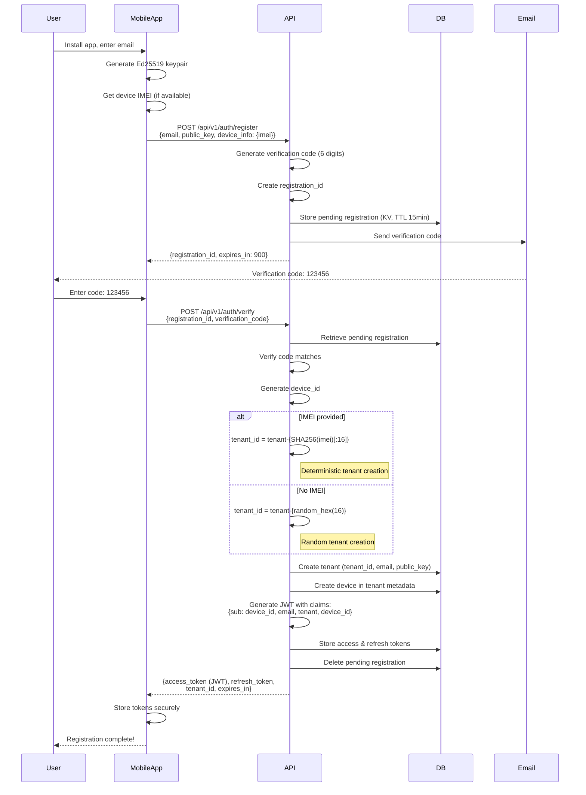
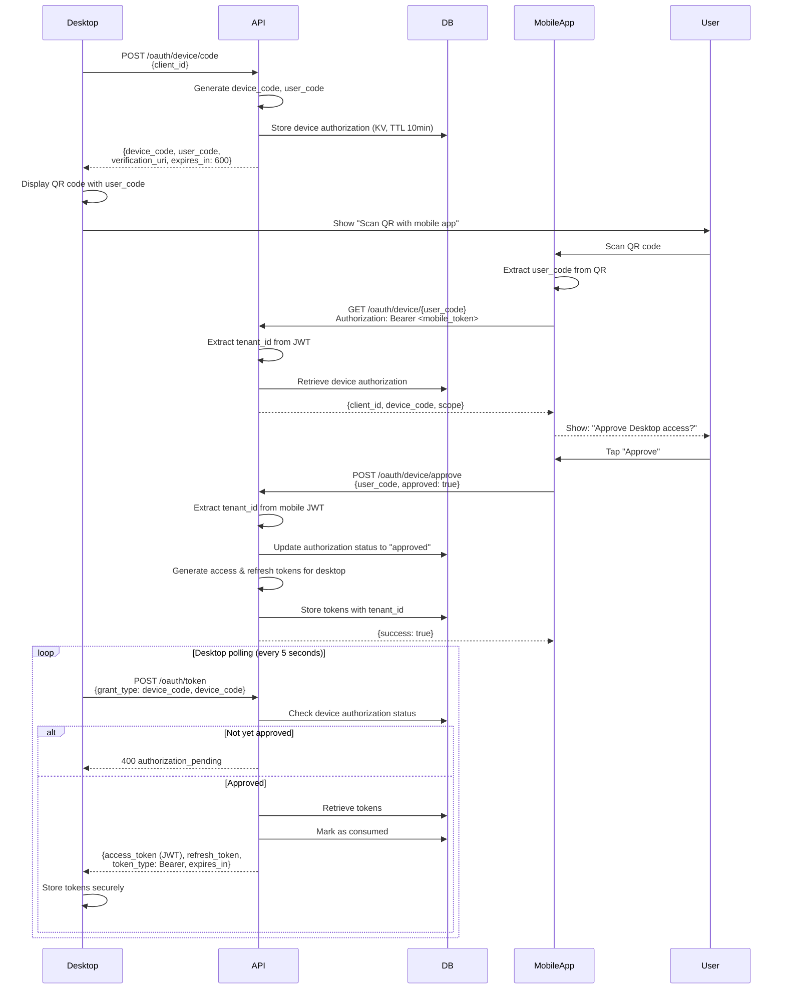
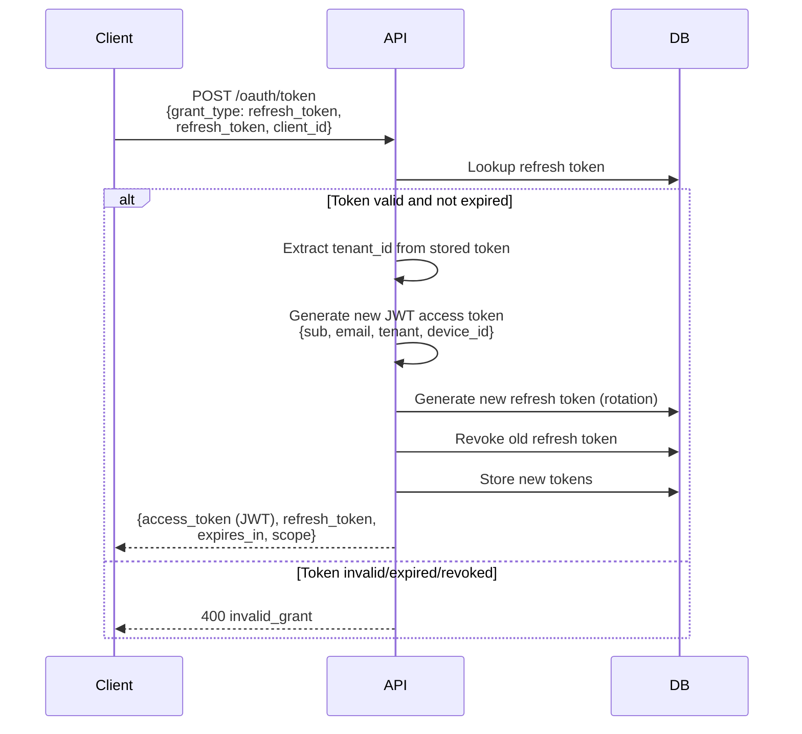
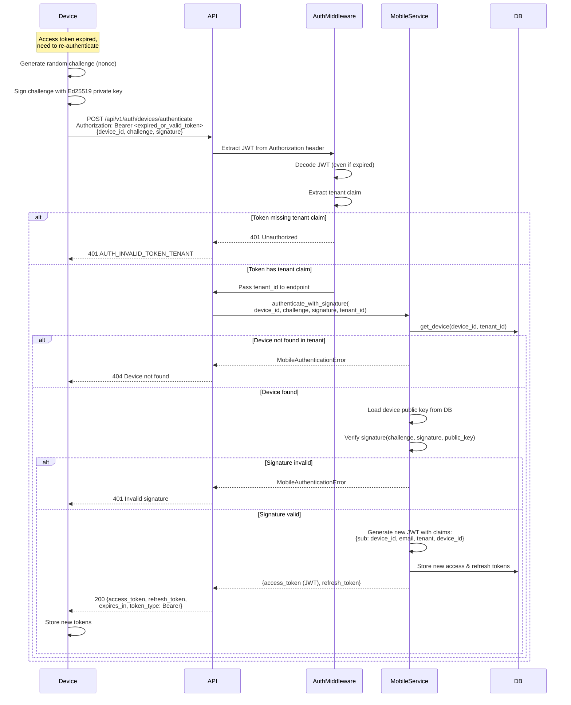

# P8FS Authentication Sequence Diagrams

This document provides visual sequence diagrams for the P8FS authentication flows.

## Flow 1: Mobile Device Registration with IMEI-Based Tenant



## Flow 2: Desktop Authentication via QR Code



## Flow 3: Token Refresh



## Flow 4: Device Re-authentication with Signature

**CRITICAL**: This flow requires tenant_id from JWT token context!



## JWT Token Structure

All access tokens are JWTs with the following claims:

```json
{
  "iss": "p8fs-auth",
  "aud": "p8fs-api",
  "sub": "device-abc123...",
  "user_id": "device-abc123...",
  "email": "user@example.com",
  "tenant": "tenant-e27a7686b8028cfe",
  "device_id": "device-abc123...",
  "device_name": "iPhone 14",
  "client_id": "mobile_device",
  "scope": "read write",
  "exp": 1731877277,
  "iat": 1731873677,
  "jti": "b7f01c8d-1e18-4a1c-8a85-fd1327082fe2",
  "kid": "file-key"
}
```

**Critical Claims**:
- `tenant`: Required for all authenticated requests, enables tenant-scoped resource access
- `device_id`: Links token to specific device for security auditing
- `sub`: Subject (device_id for device tokens, user_id for user tokens)

## Key Implementation Notes

### Tenant Scoping Requirements

1. **All device lookups must include tenant_id**:
   ```python
   # ✅ CORRECT
   device = await auth_repo.get_device(device_id, tenant_id=user.tenant_id)

   # ❌ WRONG - Will return None in production
   device = await auth_repo.get_device(device_id)
   ```

2. **Extract tenant from JWT context**:
   ```python
   # Auth middleware provides tenant_id from JWT
   async def endpoint(user: User = Depends(get_current_user)):
       tenant_id = user.tenant_id  # From JWT 'tenant' claim
   ```

3. **Device registration includes tenant in JWT**:
   ```python
   # mobile_service.py:294-303
   tokens = await self.auth_service._issue_tokens(
       user_id=device.device_id,
       client_id="mobile_device",
       scope=["read", "write"],
       additional_claims={
           "email": device.email,
           "tenant": tenant_id,  # ← CRITICAL
           "device_name": device.device_name,
           "device_id": device.device_id
       }
   )
   ```

### IMEI-Based Tenant Generation

```python
# mobile_service.py:336-382
if device_info and device_info.get("imei"):
    # Deterministic tenant ID from IMEI
    imei = device_info["imei"]
    imei_hash = hashlib.sha256(imei.encode()).hexdigest()[:16]
    tenant_id = f"tenant-{imei_hash}"
else:
    # Random tenant ID
    tenant_id = f"tenant-{secrets.token_hex(16)}"
```

**Benefits**:
- Same IMEI → Same tenant (device replacement/reinstall preserves data)
- Different IMEI → Different tenant (multi-device isolation)
- No IMEI → Random tenant (legacy/test devices)
