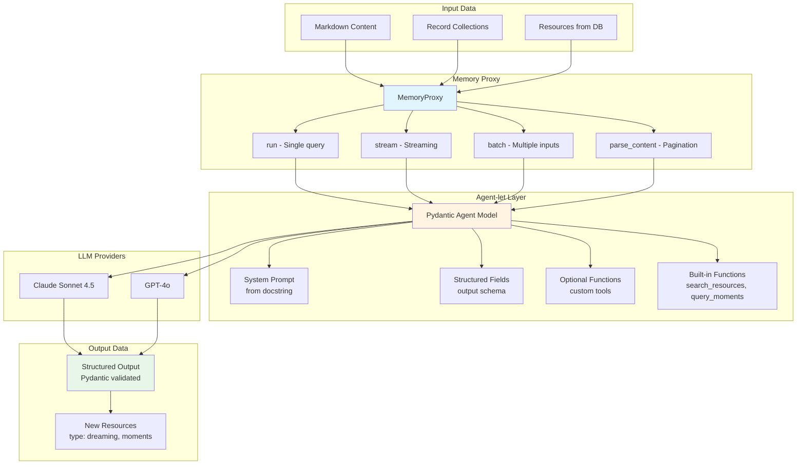
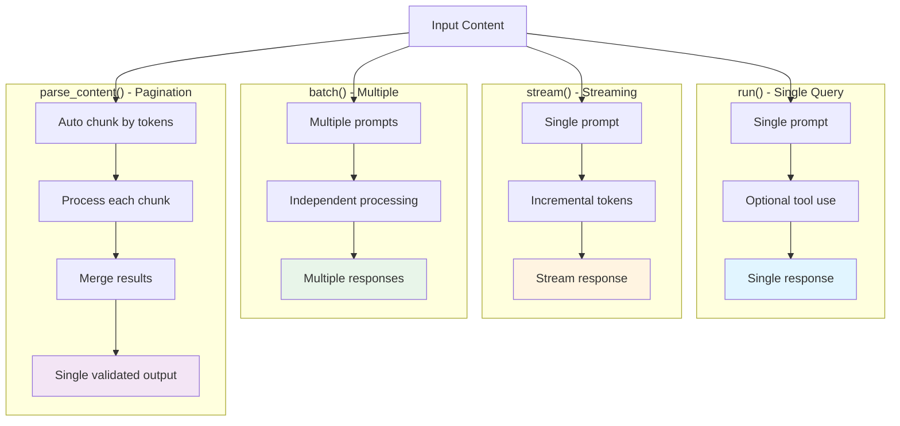
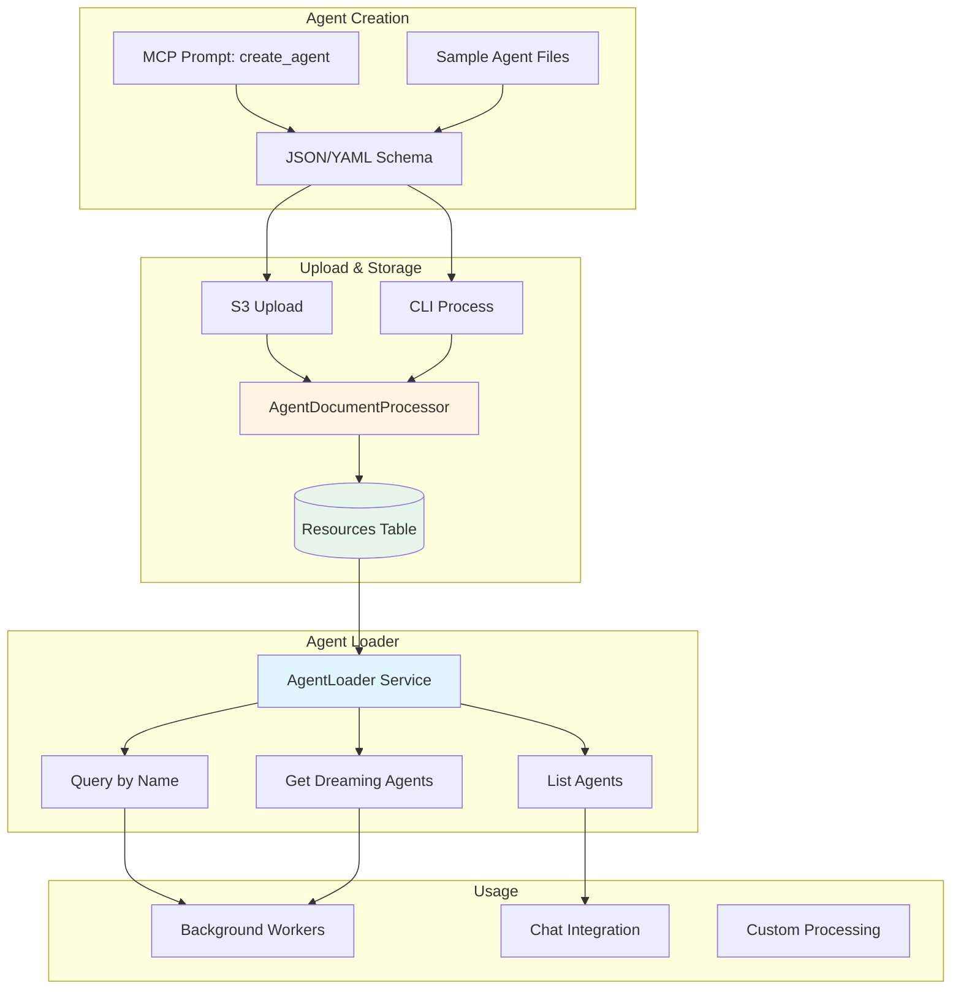

# Agentic System - Structured Content Transformation with LLMs

## Overview

The P8FS Agentic System enables structured content transformation using LLM-powered agents. Agents are Pydantic models that act as intelligent parsers and transformers, taking input data (markdown or record collections) and producing validated structured output.

## System Architecture

### High-Level Component Flow



### Agent Components

Agents combine four key components:

1. **System Prompt**: Generated from class docstring
2. **Structured Output**: Defined by Pydantic fields with descriptions
3. **Optional Functions**: Custom tool methods on the agent class
4. **Built-in Functions**: Inherited from MemoryProxy (search_resources, query_moments)

### Memory Proxy Execution Modes



## Core Principles

### 1. Agents as Pydantic Models

Agents extend `AbstractModel` and define:
- Class docstring (becomes system prompt)
- Pydantic fields (define output schema)
- Optional class methods (custom tools)

```python
from p8fs.models.base import AbstractModel
from pydantic import Field

class MyAgent(AbstractModel):
    """
    System prompt describing what this agent does.

    This docstring is automatically converted into the LLM's system prompt,
    providing context and instructions for the agent's behavior.
    """

    model_config = {
        'full_name': 'agents.MyAgent',
        'description': 'Brief description'
    }

    # Structured output fields
    summary: str = Field(description="Brief summary")
    entities: list[str] = Field(default_factory=list, description="Named entities")

    # Optional custom tool
    @classmethod
    def search_database(cls, query: str) -> list[dict]:
        """Custom tool method."""
        return []
```

### 2. Data Transformation Pattern

Agents act as parsers and transformers:

**Read → Transform → Generate**

- **Read**: Search resources, query time periods (built-in functions)
- **Transform**: Apply structured analysis and classification
- **Generate**: Create new resources from existing ones

### 3. Token-Aware Pagination

The system handles arbitrarily large inputs through intelligent pagination:

- Token-aware chunking fits minimal number of chunks within model context
- Smart boundary detection preserves record boundaries
- Automatic merging combines chunk results

### 4. Multiple Execution Modes

Different methods for different use cases:

- `run()`: Single query/response with optional tool use
- `stream()`: Streaming responses with incremental output
- `batch()`: Process multiple inputs independently
- `parse_content()`: Parse large content with automatic pagination

## Quick Start

### Basic Usage

```python
from p8fs.services.llm.memory_proxy import MemoryProxy
from p8fs.services.llm.models import CallingContext
from p8fs.models.agentlets.dreaming import DreamModel

# Create proxy with agent model
proxy = MemoryProxy(model_context=DreamModel)

# Configure context
context = CallingContext(
    model="claude-sonnet-4-5",
    tenant_id="test",
    temperature=0.1,
    max_tokens=8000
)

# Parse content
result = await proxy.parse_content(
    content=diary_text,
    context=context,
    merge_strategy="last"
)

# Access validated results
print(result.executive_summary)
print(f"Goals: {len(result.goals)}")
```

### Large Content with Pagination

```python
# Token-aware chunking handles large inputs
result = await proxy.parse_content(
    content=year_of_resources,
    context=context,
    merge_strategy="merge"  # Combine all chunks
)

print(f"Total Goals: {len(result.goals)}")
print(f"Total Relationships: {len(result.entity_relationships)}")
```

### Creating Custom Agents

```python
from p8fs.models.base import AbstractModel
from pydantic import Field

class ResearchAgent(AbstractModel):
    """
    Research agent for analyzing academic content.

    This agent searches papers, extracts citations, and produces
    structured research summaries with confidence scores.
    """

    findings: list[dict] = Field(
        default_factory=list,
        description="Research findings with evidence"
    )

    confidence: float = Field(
        default=0.0,
        ge=0.0,
        le=1.0,
        description="Confidence score"
    )

    @classmethod
    def search_papers(cls, query: str, limit: int = 10) -> list[dict]:
        """Search academic papers by query."""
        # Implementation
        return []
```

## Production Use Cases

### Dream Worker: Resource Summarization

Scheduled worker that summarizes resources into "dreaming" type resources:

```python
@scheduled(hour="*/6")
async def dream_worker(tenant_id: str):
    """Run every 6 hours to create dream summaries."""

    # Search recent resources
    resources = await search_resources(
        tenant_id=tenant_id,
        days_back=7,
        limit=100
    )

    # Create agent and process
    proxy = MemoryProxy(model_context=DreamModel)
    result = await proxy.parse_content(
        content=resources,
        context=context
    )

    # Save as new resource
    await save_resource(
        tenant_id=tenant_id,
        type="dreaming",
        content=result.model_dump()
    )
```

**Output**: New resource with executive summary, goals, relationships, dreams, fears

### Moment Worker: Activity Classification

Scheduled worker that classifies time periods into activity moments:

```python
@scheduled(day="*/1")
async def moment_worker(tenant_id: str):
    """Run daily to classify activity moments."""

    # Query resources for specific time period
    resources = await query_moments(
        tenant_id=tenant_id,
        start_date="2025-01-13",
        days=3
    )

    # Create agent and classify
    proxy = MemoryProxy(model_context=MomentBuilder)
    moments = await proxy.parse_content(
        content=resources,
        context=context
    )

    # Save moment collection
    for moment in moments:
        await save_moment(
            tenant_id=tenant_id,
            start_time=moment.start_time,
            end_time=moment.end_time,
            activity=moment.name,
            resources=moment.resource_ids
        )
```

**Output**: Collection of moments with temporal boundaries, emotions, topics, present persons

## Merge Strategies

When processing chunked content, results are merged based on strategy:

### "first" - Use First Chunk

```python
merge_strategy="first"
```

Returns the first chunk's results. Use when important information is at the beginning.

### "last" - Use Last Chunk (Default)

```python
merge_strategy="last"
```

Returns the last chunk's results. Use when later chunks have the most complete analysis.

### "merge" - Combine All Chunks

```python
merge_strategy="merge"
```

Intelligently merges all chunks:
- **Lists**: Concatenates (goals, dreams, entities, etc.)
- **Scalars**: Takes first non-null value (summary, confidence, etc.)

**Example**:
```python
# Chunk 1: {"goals": ["Launch product"], "summary": "Startup phase"}
# Chunk 2: {"goals": ["Raise funding"], "summary": None}
# Merged:  {"goals": ["Launch product", "Raise funding"], "summary": "Startup phase"}
```

## Pagination Implementation

### Automatic Chunking

Content is automatically chunked when it exceeds token limits:

```python
def _chunk_content(self, content: str, chunk_size: int) -> list[str]:
    """Split content into chunks by character count."""
    if len(content) <= chunk_size:
        return [content]

    chunks = []
    start = 0
    while start < len(content):
        end = start + chunk_size
        chunk = content[start:end]
        chunks.append(chunk)
        start = end

    return chunks
```

### Processing Chunks

Each chunk is processed with instructions to prevent tool use:

```python
for i, chunk in enumerate(chunks):
    question = f"Analyze this content (part {i+1}/{len(chunks)}) and return only the structured JSON analysis without using any tools or functions.\n\n{chunk}"

    response = await self.run(question, context, max_iterations=1)
    parsed = self._extract_json(response)
    if parsed:
        results.append(parsed)
```

### JSON Extraction

The system handles multiple response formats:

1. Direct JSON parsing
2. Markdown code block with `json` language
3. Markdown code block without language
4. First `{` to last `}`

```python
def _extract_json(self, text: str) -> dict | None:
    """Extract JSON from various response formats."""
    # Try direct parsing
    try:
        return json.loads(text)
    except json.JSONDecodeError:
        pass

    # Try markdown patterns
    patterns = [
        r'```json\s*(\{[\s\S]+\})\s*```',
        r'```\s*(\{[\s\S]+\})\s*```'
    ]

    for pattern in patterns:
        matches = re.findall(pattern, text, re.DOTALL)
        if matches:
            try:
                return json.loads(matches[-1])
            except json.JSONDecodeError:
                pass

    # Try brace extraction
    start = text.find('{')
    end = text.rfind('}')
    if start != -1 and end != -1 and end > start:
        try:
            return json.loads(text[start:end+1])
        except json.JSONDecodeError:
            pass

    return None
```

## Tool Registration

See `08 function-registration.md` for complete documentation on registering custom tool methods.

### Registration Rules

**Included (Registered as Tools)**:
- User-defined class methods (`@classmethod`)
- User-defined instance methods
- Methods with `__qualname__` starting with agent class name

**Excluded (NOT Registered)**:
- AbstractModel base methods
- Pydantic utility methods
- Private methods (starting with `_`)
- Pydantic decorators (`@model_validator`, `@field_serializer`)

### Built-in Functions

All agents inherit built-in functions from MemoryProxy:

```python
# Built-in functions available to all agents:
search_resources(days_back: int = 7, limit: int = 100) -> list[dict]
query_moments(start_date: str, days: int = 3) -> list[dict]
```

These can be called by the LLM during agent execution to gather context.

## Performance

### Benchmarks

**Claude Sonnet 4.5** (11,700 chars, 3 chunks):
- Chunk 1: ~68 seconds
- Chunk 2: ~67 seconds
- Chunk 3: ~66 seconds
- Total: ~3.5 minutes

**GPT-4o** (3,000 chars, single chunk):
- Processing: ~22 seconds
- Cost: $0.0533 (520 prompt + 629 completion tokens)
- ~3x faster than Claude

### Optimization Tips

1. Use smaller chunks for faster feedback: `chunk_size=2000`
2. Use GPT-4o for speed: ~3x faster than Claude
3. Use "last" strategy for single summary: Avoids expensive merge
4. Reduce max_tokens: Lower `max_tokens` for faster responses

## Testing

### Basic Test

```python
import asyncio
from pathlib import Path
from p8fs.models.agentlets.dreaming import DreamModel
from p8fs.services.llm.memory_proxy import MemoryProxy
from p8fs.services.llm.models import CallingContext

async def test_parse_content():
    # Read sample content
    sample_file = Path("tests/sample_data/content/diary_sample.md")
    content = sample_file.read_text()

    # Create proxy
    proxy = MemoryProxy(model_context=DreamModel)

    # Parse with pagination
    context = CallingContext(
        model="claude-sonnet-4-5",
        tenant_id="test",
        temperature=0.1,
        max_tokens=8000
    )

    result = await proxy.parse_content(
        content=content * 3,  # Duplicate for chunking test
        context=context,
        chunk_size=4000,
        merge_strategy="last"
    )

    # Validate results
    assert isinstance(result, DreamModel)
    assert result.executive_summary is not None
    assert len(result.goals) > 0

    print(f"✅ Parsed successfully")
    print(f"   Goals: {len(result.goals)}")
    print(f"   Relationships: {len(result.entity_relationships)}")

if __name__ == "__main__":
    asyncio.run(test_parse_content())
```

### CLI Evaluation

```bash
# Evaluate agent on file input
export ANTHROPIC_API_KEY=your-key
uv run python -m p8fs.cli eval \
  --agent-model agentlets.moments.MomentBuilder \
  --file tests/sample_data/moment_samples/tenant_1/transcript_2025-01-13T09-00-00Z_input.json \
  --model claude-sonnet-4-5 \
  --format yaml
```

### Integration Tests

```bash
# Run integration tests with real LLM
export ANTHROPIC_API_KEY=your-key
uv run pytest tests/integration/test_moment_builder.py -v
```

## Architecture Decisions

### 1. Prompting-Based Tool Control

**Problem**: LLMs might call registered tools instead of returning structured output.

**Solution**: Add instruction to user query rather than programmatically disabling tools.

```python
question = f"Analyze this content and return only the structured JSON analysis without using any tools or functions.\n\n{chunk}"
```

**Benefits**:
- Keeps tools available (orthogonal concerns)
- Uses natural language instruction
- Works across different providers
- Maintains clean architecture

### 2. YAML Schema Format

System prompts use YAML schema format for better readability:

```yaml
executive_summary:
  type: string
  description: Brief summary of current situation

goals:
  type: array
  items:
    type: object
  description: Goals and aspirations mentioned
```

Both Claude and GPT handle YAML schemas effectively.

### 3. Character-Based Chunking

Current implementation uses simple character count splitting:
- Default chunk size: 4000 characters
- Simple and reliable
- Works well in practice

**Future**: Token-based chunking with tiktoken for more accurate context window management.

## API Reference

### MemoryProxy.parse_content()

```python
async def parse_content(
    self,
    content: str,
    context: CallingContext | None = None,
    chunk_size: int = 4000,
    merge_strategy: str = "last"
) -> Any:
    """
    Parse large content using structured output with automatic pagination.

    Args:
        content: Large content to parse
        context: Calling context (will auto-set prefer_json=True)
        chunk_size: Max characters per chunk (default: 4000)
        merge_strategy: How to merge results - 'last', 'first', or 'merge'

    Returns:
        Parsed and validated model instance

    Raises:
        ValueError: If no model_context was provided to MemoryProxy
    """
```

### Utility Methods

```python
def _chunk_content(self, content: str, chunk_size: int) -> list[str]:
    """Split content into chunks by character count."""

def _extract_json(self, text: str) -> dict | None:
    """Extract JSON from markdown or plain text response."""

def _merge_results(self, results: list[dict], strategy: str) -> dict:
    """Merge multiple result dictionaries based on strategy."""
```

## Related Documentation

- **Function Registration**: `08 function-registration.md` - Tool registration guide
- **Memory Proxy**: `02 memory-proxy.md` - MemoryProxy usage
- **Document Parsers**: `09 doc-parsers.md` - Advanced document processing

## Agent File Handling System

### Overview

The agent file handling system enables users to create, upload, and manage custom agent schemas as JSON or YAML files. These agents can be configured for background processing, automatic content analysis, and insight extraction.

### Architecture



### Agent Schema Structure

Agents are defined as JSON Schema documents with special metadata:

```json
{
  "p8-type": "agent",
  "short_name": "action_tracker",
  "name": "Action Item Tracker",
  "title": "Meeting Action Item Extraction Agent",
  "version": "1.0.0",
  "description": "Extracts action items, deadlines, and assignees from meeting notes and documents. Focuses on identifying concrete tasks with clear ownership.",
  "fully_qualified_name": "user.agents.action_tracker",
  "use_in_dreaming": true,
  "priority": 1,
  "properties": {
    "action_items": {
      "type": "array",
      "items": {
        "type": "object",
        "properties": {
          "task": {"type": "string", "description": "The action to be taken"},
          "assignee": {"type": "string", "description": "Person responsible"},
          "deadline": {"type": "string", "description": "Due date if specified"}
        },
        "required": ["task"]
      },
      "description": "List of extracted action items"
    },
    "confidence": {
      "type": "number",
      "minimum": 0,
      "maximum": 1,
      "description": "Confidence in the extraction"
    }
  },
  "required": ["action_items"],
  "tools": []
}
```

### Required Fields

| Field | Type | Description |
|-------|------|-------------|
| `p8-type` | string | Must be `"agent"` for automatic processing |
| `short_name` | string | Unique identifier (lowercase, underscores) |
| `version` | string | Semantic version (e.g., "1.0.0") |
| `description` | string | System prompt with agent instructions |
| `properties` | object | JSON Schema for structured output |

### Optional Fields

| Field | Type | Default | Description |
|-------|------|---------|-------------|
| `name` | string | short_name | Display name |
| `title` | string | name | Full title |
| `fully_qualified_name` | string | auto-generated | Namespace identifier |
| `use_in_dreaming` | boolean | `false` | Include in background processing |
| `priority` | integer | 2 | Processing priority (1-3) |
| `tools` | array | `[]` | Available tool definitions |

### Priority Levels

- **Priority 1 (High)**: Critical agents (security monitoring, compliance checks)
- **Priority 2 (Normal)**: Standard agents (insight extraction, categorization)
- **Priority 3 (Low)**: Optional agents (suggestions, creative analysis)

### Creating Agents with MCP Prompt

The `create_agent` MCP prompt guides users through agent creation:

```python
# In your MCP-enabled IDE/client
create_agent(
    purpose="Extract key insights from daily activity",
    name="daily_insights",
    priority=2
)
```

The prompt provides:
- Suggested agent name based on purpose
- Complete JSON schema template
- Field definitions tailored to the use case
- Upload instructions

### Uploading Agents

#### Option 1: S3 Upload (Recommended for MCP clients)

```bash
# 1. Get presigned upload URL
read_resource(uri="s3-upload://tenant-test/daily_insights.json")

# 2. Upload using curl
curl -T daily_insights.json "{presigned_url}"

# 3. Agent is automatically processed and stored
```

#### Option 2: CLI Processing

```bash
# Process agent file directly
uv run python -m p8fs.cli process agents/daily_insights.json --tenant-id tenant-test

# Or process entire directory
uv run python -m p8fs.cli process agents/ --tenant-id tenant-test
```

### Agent Processing Pipeline

When an agent file is uploaded:

1. **Detection**: `AgentDocumentProcessor` detects `p8-type == "agent"`
2. **Extraction**: Metadata extracted (name, version, priority, etc.)
3. **Storage**: Saved as resource with `category="agent"`
4. **Indexing**: Stored with deterministic ID for upsert by name
5. **Embeddings**: Description embedded for semantic search

### Loading Agents

#### AgentLoader Service

```python
from p8fs.services.agent_loader import AgentLoader

# Initialize loader
loader = AgentLoader(tenant_id="tenant-test")

# Load specific agent
agent = await loader.load_agent_by_name("daily_insights")

# Access schema
print(agent["version"])  # "1.0.0"
print(agent["description"])  # System prompt
print(agent["properties"])  # Output schema
```

#### List Agents

```python
# List all agents
all_agents = await loader.list_agents()

# List only dreaming agents
dreaming_agents = await loader.list_agents(use_in_dreaming=True)

# Convenience method
dreaming_agents = await loader.get_dreaming_agents()
```

#### Delete Agents

```python
# Delete by name
deleted = await loader.delete_agent_by_name("daily_insights")
```

### Upsert Behavior

Agents are upserted by `short_name`:

```python
# First upload - creates new agent
{
  "short_name": "insights",
  "version": "1.0.0",
  "description": "Extract insights..."
}

# Second upload - updates existing agent
{
  "short_name": "insights",  # Same name
  "version": "1.1.0",         # New version
  "description": "Extract insights and trends..."  # Updated
}
```

The second upload replaces the first, maintaining the same resource ID.

### Background Processing Integration

Agents with `use_in_dreaming: true` are automatically included in background processing:

```python
from p8fs.services.agent_loader import AgentLoader

async def process_dreaming_agents(tenant_id: str):
    """Run all dreaming agents on recent content."""

    loader = AgentLoader(tenant_id)
    agents = await loader.get_dreaming_agents()

    # Sort by priority
    agents.sort(key=lambda a: a.get("priority", 2))

    for agent_schema in agents:
        # Load agent into processing pipeline
        await process_with_agent(agent_schema)
```

### Example Use Cases

#### 1. Security Monitor (Priority 1)

```json
{
  "p8-type": "agent",
  "short_name": "security_monitor",
  "description": "Monitor content for security concerns, PII leakage, or sensitive data exposure.",
  "priority": 1,
  "use_in_dreaming": true,
  "properties": {
    "alerts": {
      "type": "array",
      "items": {"type": "string"},
      "description": "Security alerts found"
    },
    "severity": {
      "type": "string",
      "enum": ["low", "medium", "high", "critical"]
    }
  }
}
```

#### 2. Theme Extractor (Priority 2)

```json
{
  "p8-type": "agent",
  "short_name": "theme_extractor",
  "description": "Identify recurring themes, topics, and patterns across documents.",
  "priority": 2,
  "use_in_dreaming": true,
  "properties": {
    "themes": {
      "type": "array",
      "items": {
        "type": "object",
        "properties": {
          "name": {"type": "string"},
          "frequency": {"type": "integer"},
          "examples": {"type": "array", "items": {"type": "string"}}
        }
      }
    }
  }
}
```

#### 3. Suggestion Generator (Priority 3)

```json
{
  "p8-type": "agent",
  "short_name": "suggestions",
  "description": "Generate creative suggestions and recommendations based on user activity.",
  "priority": 3,
  "use_in_dreaming": true,
  "properties": {
    "suggestions": {
      "type": "array",
      "items": {"type": "string"}
    },
    "reasoning": {"type": "string"}
  }
}
```

### Testing

#### Integration Tests

```bash
# Run agent file handler tests
uv run pytest tests/integration/test_agent_document_processor.py --integration -v
```

Tests cover:
- JSON and YAML processing
- Upsert by name
- Agent loader operations
- End-to-end file processing

#### Manual Testing

```bash
# 1. Create sample agent
cat > test_agent.json <<EOF
{
  "p8-type": "agent",
  "short_name": "test_agent",
  "version": "1.0.0",
  "description": "Test agent for validation",
  "use_in_dreaming": false,
  "properties": {
    "result": {"type": "string"}
  }
}
EOF

# 2. Process agent
uv run python -m p8fs.cli process test_agent.json --tenant-id tenant-test

# 3. Verify in database
docker exec percolate psql -U postgres -d app -c \
  "SELECT name, category, metadata->>'version' as version FROM resources WHERE category='agent';"
```

### Sample Agents

Sample agent schemas are available in:
- `tests/sample_data/agents/sample_qa_agent.json` - Question answering agent
- Reference implementation showing all features

### API Reference

#### AgentLoader

```python
class AgentLoader:
    """Service for loading agent schemas from resources table."""

    def __init__(self, tenant_id: str):
        """Initialize with tenant context."""

    async def load_agent_by_name(self, name: str) -> Optional[Dict[str, Any]]:
        """Load agent schema by short_name."""

    async def list_agents(
        self,
        use_in_dreaming: Optional[bool] = None,
        limit: int = 100
    ) -> List[Dict[str, Any]]:
        """List all agents with optional filtering."""

    async def get_dreaming_agents(self) -> List[Dict[str, Any]]:
        """Get all agents with use_in_dreaming=True."""

    async def delete_agent_by_name(self, name: str) -> bool:
        """Delete agent by name."""
```

#### Convenience Functions

```python
async def load_agent(name: str, tenant_id: str) -> Optional[Dict[str, Any]]:
    """Load agent schema (convenience function)."""

async def list_agents(
    tenant_id: str,
    use_in_dreaming: Optional[bool] = None
) -> List[Dict[str, Any]]:
    """List agents (convenience function)."""
```

### Best Practices

1. **Descriptive System Prompts**: The `description` field should clearly explain what the agent does and how it should behave
2. **Specific Output Schema**: Define precise `properties` for structured output
3. **Appropriate Priority**: Use priority 1 only for critical agents
4. **Versioning**: Increment version when making significant changes
5. **Testing**: Test agents locally before enabling in production
6. **Unique Names**: Use descriptive, unique `short_name` values

### Troubleshooting

**Agent not found after upload:**
- Check category: `SELECT * FROM resources WHERE category='agent' AND tenant_id='tenant-test';`
- Verify p8-type in file: Must be exactly `"agent"`
- Check processing logs for errors

**Agent not in dreaming:**
- Verify `use_in_dreaming: true` in schema
- Reload agent list: `await loader.get_dreaming_agents()`

**Version not updating:**
- Check if upload succeeded
- Verify same `short_name` is being used
- Check resource updated_at timestamp

### Related Files

- `src/p8fs/workers/processors/document_processor.py:63-127` - AgentDocumentProcessor
- `src/p8fs/services/agent_loader.py` - AgentLoader service
- `tests/integration/test_agent_document_processor.py` - Integration tests
- `tests/sample_data/agents/sample_qa_agent.json` - Sample agent
- `p8fs-api/src/p8fs_api/routers/mcp_server.py:195-294` - MCP create_agent prompt

## Implementation Files

- `src/p8fs/services/llm/memory_proxy.py:1647-1769` - Core implementation
- `src/p8fs/models/base.py` - AbstractModel base class
- `src/p8fs/models/agentlets/dreaming.py` - Example dream agent
- `src/p8fs/models/agentlets/moments.py` - Example moment agent
- `src/p8fs/utils/typing.py` - Type inspection utilities
