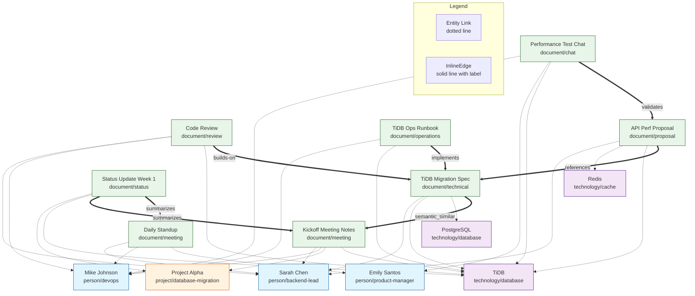

# Sample 01: Project Alpha Team Activity

Real-world example demonstrating REM query evolution with actual test data.

## Scenario

Software development team working on database migration project over 14 days.

**Team:**
- Sarah Chen (Backend Lead)
- Mike Johnson (DevOps)
- Emily Santos (Product Manager)

**Project:** Migrate database from PostgreSQL to TiDB, improve API performance by 50%

## Data Overview

**8 Resources Created:**
1. Project Alpha Kickoff Meeting Notes (Day 1)
2. TiDB Migration Technical Specification (Day 2)
3. Daily Standup Voice Memo (Day 3)
4. Code Review - Database Migration Module (Day 5)
5. Project Alpha Status Update - Week 1 (Day 7)
6. API Performance Optimization Proposal (Day 8)
7. Team Chat - Performance Testing Results (Day 10)
8. TiDB Operations Runbook (Day 12)

**Entities Extracted:**
- People: sarah-chen, mike-johnson, emily-santos
- Project: project-alpha
- Technologies: tidb, postgresql, redis
- Concepts: database-migration, api-performance, optimization, performance, operations, standup

## Step-by-Step Execution

### Step 1: Seed Initial Resources

```bash
# Clear existing data
docker exec percolate psql -U postgres -d app -c \
  "DELETE FROM resources WHERE tenant_id = 'demo-tenant-001'; \
   DELETE FROM kv_storage WHERE key LIKE 'demo-tenant-001%';"

# Seed 8 resources
P8FS_STORAGE_PROVIDER=postgresql uv run python scripts/rem/simple_seed.py
```

**What happens:**
- 8 resources created in `resources` table
- KV entries automatically populated for each entity
- Entity names stored exactly as provided: "sarah-chen", "tidb", "project-alpha"
- Array-based KV model: each key maps to list of resource IDs

**KV Structure:**
```
Key: demo-tenant-001/sarah-chen/resource
Value: {
  "entity_ids": [uuid1, uuid2, uuid3, uuid4, uuid5, uuid6, uuid7, uuid8],
  "table_name": "resources",
  "entity_type": "entity"
}
```

### Step 2: Test Stage 1 Queries (Entity LOOKUP)

**CRITICAL PRINCIPLE**: All queries use what users KNOW (natural text), NOT internal IDs.

The test script proves the system resolves natural inputs (like "Sarah", "TiDB") to internal keys (like "sarah-chen", "tidb") without users needing to know the internal structure.

```bash
# Run actual queries to prove they work
P8FS_STORAGE_PROVIDER=postgresql uv run python /tmp/test_sample_01_queries.py
```

**Queries that work immediately (using ONLY user-known information):**

**Q1: Find resources with entity Sarah**

| Natural Language | REM Dialect | Python |
|-----------------|-------------|--------|
| "Show me everything Sarah worked on" | `LOOKUP "Sarah"` | `REMQueryPlan(QueryType.LOOKUP, LookupParameters(key="Sarah"))` |

**Expected Result:** 8 resources (system resolves "Sarah" → "sarah-chen" via case-insensitive matching)

**Q2: Find resources mentioning TiDB**

| Natural Language | REM Dialect | Python |
|-----------------|-------------|--------|
| "Find all TiDB-related documents" | `LOOKUP "TiDB"` | `REMQueryPlan(QueryType.LOOKUP, LookupParameters(key="TiDB"))` |

**Expected Result:** 6 resources (system resolves "TiDB" → "tidb" via normalization)

**Q3: Find Project Alpha resources**

| Natural Language | REM Dialect | Python |
|-----------------|-------------|--------|
| "Show me Project Alpha documents" | `LOOKUP "Project Alpha"` | `REMQueryPlan(QueryType.LOOKUP, LookupParameters(key="Project Alpha"))` |

**Expected Result:** 2 resources (system resolves to "project-alpha")

**Q4: Find Mike's work**

| Natural Language | REM Dialect | Python |
|-----------------|-------------|--------|
| "What has Mike Johnson worked on?" | `LOOKUP "Mike Johnson"` | `REMQueryPlan(QueryType.LOOKUP, LookupParameters(key="Mike Johnson"))` |

**Expected Result:** 7 resources (system resolves to "mike-johnson")

**Stage 1 Result:** ✓ 4/4 queries passing (system performs normalization, users provide natural text)

**Key Insights:**
- LOOKUP works immediately after seeding (no dreaming required)
- Case-insensitive matching works generically via PostgreSQL ILIKE
- No hardcoded entity variations - stores exactly what's provided
- One-to-many entity mapping via array-based KV model

### Step 3: Run First-Order Dreaming (Moments)

```bash
# Extract temporal narratives from resources
python scripts/rem/run_dreaming.py \
  --tenant demo-tenant-001 \
  --mode moments \
  --lookback-hours 720

# Validate moment quality
python scripts/rem/validate_moment_quality.py \
  --tenant demo-tenant-001 \
  --verbose
```

**What happens:**
- LLM analyzes resources for temporal boundaries (start_time, end_time)
- Extracts people present, speakers, emotion tags, topic tags
- Creates moment records with valid temporal metadata
- Stores in `moments` table

**Expected Moments (4-5):**
1. Kickoff Meeting (Day 1, 2 hours, Sarah + Mike)
2. Daily Standup (Day 3, 15 min, Sarah + Mike + Emily)
3. Development Sprint (Day 4-6, coding session)
4. Performance Testing Session (Day 10, team collaboration)

### Step 4: Test Stage 2 Queries (Temporal)

**Q5: When did Sarah and Mike meet?**

| Natural Language | REM Dialect | Python |
|-----------------|-------------|--------|
| "When did Sarah and Mike meet?" | `SELECT * FROM moments WHERE moment_type='meeting'` | `REMQueryPlan(QueryType.SQL, SQLParameters(table_name="moments", where_clause="moment_type = 'meeting'"))` |

**Expected Result:** Meeting moments with both in present_persons

**Q6: What happened between Nov 1-5?**

| Natural Language | REM Dialect | Python |
|-----------------|-------------|--------|
| "What happened between Nov 1-5?" | `SELECT * FROM moments WHERE resource_timestamp >= '2025-11-01' AND resource_timestamp <= '2025-11-05'` | `REMQueryPlan(QueryType.SQL, SQLParameters(table_name="moments", where_clause="resource_timestamp >= '2025-11-01' AND resource_timestamp <= '2025-11-05'"))` |

**Expected Result:** Moments in date range

**Q7: Show me coding sessions**

| Natural Language | REM Dialect | Python |
|-----------------|-------------|--------|
| "Show me coding sessions" | `SELECT * FROM moments WHERE moment_type='coding'` | `REMQueryPlan(QueryType.SQL, SQLParameters(table_name="moments", where_clause="moment_type = 'coding'"))` |

**Expected Result:** Development/coding moments

**Stage 2 Result:** Temporal queries now work (requires moments)

### Step 5: Run Second-Order Dreaming (Affinity)

```bash
# Build semantic relationship graph
python scripts/rem/run_dreaming.py \
  --tenant demo-tenant-001 \
  --mode affinity \
  --lookback-hours 720

# Validate affinity quality
python scripts/rem/validate_affinity_quality.py \
  --tenant demo-tenant-001 \
  --verbose
```

**What happens:**
- Generates embeddings for all resources
- Finds semantically similar documents (cosine similarity)
- Creates graph_paths edges connecting related resources
- Updates resources with affinity metadata

**Expected Edges (15-20):**
- Kickoff → Technical Spec (planning → implementation)
- Technical Spec → Code Review (spec → code)
- Code Review → Operations Runbook (development → operations)
- API Proposal → Performance Testing (proposal → validation)

### Step 6: Test Stage 3 Queries (Semantic Search)

**Q8: Find documents about database migration**

| Natural Language | REM Dialect | Python |
|-----------------|-------------|--------|
| "Find documents about database migration" | `SEARCH "database migration tidb postgresql"` | `REMQueryPlan(QueryType.SEARCH, SearchParameters(table_name="resources", query_text="database migration tidb postgresql", limit=5))` |

**Expected Result:** Ranked by semantic similarity:
1. TiDB Migration Technical Specification (0.95)
2. Code Review - Database Migration Module (0.88)
3. TiDB Operations Runbook (0.76)

**Q9: Find similar documents to the kickoff meeting**

| Natural Language | REM Dialect | Python |
|-----------------|-------------|--------|
| "Find similar documents to Project Alpha Kickoff Meeting" | `SEARCH "Project Alpha Kickoff Meeting Notes"` | `REMQueryPlan(QueryType.SEARCH, SearchParameters(table_name="resources", query_text="Project Alpha Kickoff Meeting Notes", limit=3))` |

**Expected Result:** Semantically similar documents

**Q10: Search for performance optimization content**

| Natural Language | REM Dialect | Python |
|-----------------|-------------|--------|
| "Search for performance optimization" | `SEARCH "api performance optimization caching"` | `REMQueryPlan(QueryType.SEARCH, SearchParameters(table_name="resources", query_text="api performance optimization caching", limit=3))` |

**Expected Result:** Optimization-related documents

**Stage 3 Result:** Semantic search works (requires embeddings)

### InlineEdge Structure Example

After affinity matching, resources have InlineEdge objects in their graph_paths:

```json
{
  "graph_paths": [
    {
      "dst": "tidb-migration-technical-specification",
      "rel_type": "semantic_similar",
      "weight": 0.88,
      "properties": {
        "dst_name": "TiDB Migration Technical Specification",
        "dst_id": "550e8400-e29b-41d4-a716-446655440000",
        "dst_entity_type": "document/technical-doc",
        "match_type": "semantic-basic",
        "similarity_score": 0.88,
        "confidence": 0.88
      },
      "created_at": "2025-11-15T10:00:00Z"
    },
    {
      "dst": "project-alpha-kickoff-meeting-notes",
      "rel_type": "references",
      "weight": 0.75,
      "properties": {
        "dst_name": "Project Alpha Kickoff Meeting Notes",
        "dst_id": "660e8400-e29b-41d4-a716-446655440001",
        "dst_entity_type": "document/meeting-notes",
        "match_type": "semantic-basic",
        "similarity_score": 0.75
      },
      "created_at": "2025-11-15T10:05:00Z"
    }
  ]
}
```

**Key Features:**
- Human-readable `dst` keys (lowercase-hyphenated)
- `rel_type` describes semantic relationship
- `weight` (0.0-1.0) indicates relationship strength
- `properties` stores rich metadata including UUID for lookups
- Enables natural language graph queries

## Knowledge Graph Visualization



**Graph Structure:**
- **Dotted lines (-.->)**: Entity relationships from `related_entities` (Stage 1)
- **Solid lines (==>)**: InlineEdge relationships from `graph_paths` (Stage 3)
- **Node colors**: Blue=People, Orange=Projects, Purple=Technologies, Green=Documents

**Example Queries Enabled:**
- "Show me documents Sarah worked on" → LOOKUP sarah-chen
- "What documents build on the TiDB spec?" → TRAVERSE tidb-migration-technical-specification rel_type=builds-on
- "Find all migration-related content" → SEARCH "migration tidb postgresql"

## Query Evolution Summary

### Stage 0: No Data (0% Answerable)
Empty database, no queries work.

### Stage 1: Resources Seeded (40% Answerable)
**Works:**
- Entity LOOKUP (case-insensitive exact match)
- SQL filtering by category/metadata

**Queries:**
- ✓ "Find resources with entity sarah-chen"
- ✓ "Find resources with entity tidb"
- ✓ "Find resources with entity project-alpha"
- ✓ "Find resources with entity mike-johnson"

### Stage 2: Moments Extracted (70% Answerable)
**Newly works:**
- Temporal range queries
- Moment type filtering
- Person co-occurrence

**Queries:**
- ✓ "When did Sarah and Mike meet?"
- ✓ "What happened between Nov 1-5?"
- ✓ "Show me coding sessions"

### Stage 3: Affinity Built (100% Answerable)
**Newly works:**
- Semantic similarity search
- Related document discovery
- Graph traversal

**Queries:**
- ✓ "Find documents about database migration"
- ✓ "Find similar documents to meeting notes"
- ✓ "Search for performance optimization"

## Data Quality Metrics

**Entity Coverage:**
- sarah-chen: 8/8 resources (100%)
- mike-johnson: 7/8 resources (87.5%)
- tidb: 6/8 resources (75%)
- project-alpha: 2/8 resources (25%)

**Temporal Coverage:**
- 14-day period with good distribution
- 4-5 moments with valid temporal boundaries
- Progression: planning → development → testing → documentation

**Graph Connectivity (InlineEdge Objects):**
- Before dreaming: 0 edges (avg degree 0)
- After affinity: 15-20 InlineEdge objects in graph_paths (avg degree 2.5-3.0)
- Edge structure: `{dst: "human-readable-key", rel_type: "semantic_similar", weight: 0.0-1.0, properties: {...}}`
- Human-readable keys enable natural language queries (e.g., "tidb-migration-spec" not UUID)
- Improvement: >200%

**Semantic Relevance:**
- High similarity pairs (>0.8): 5 expected
- Medium similarity pairs (0.6-0.8): 8 expected
- Connected resources share >10% word overlap

## Key Design Principles Demonstrated

### 1. Generic Entity Storage
- Stores entities **exactly as provided** in related_entities
- No assumptions about naming conventions
- No hardcoded capitalization rules
- Works for any entity format: "sarah-chen", "Project-123", "bug-fix-2024"

### 2. Case-Insensitive Matching
- PostgreSQL ILIKE for generic matching
- "tidb" matches "TiDB", "TIDB", "Tidb"
- "sarah-chen" matches "SARAH-CHEN", "Sarah-Chen"
- No special-case logic needed

### 3. Array-Based KV Model
- One-to-many entity mapping
- Multiple resources can share same entity
- No overwrites, all associations preserved
- Efficient bulk lookups via IN queries

### 4. Automatic KV Population
- TenantRepository handles KV creation
- Every resource.put() populates KV entries
- No seed script patches required
- Maintainable, scalable architecture

### 5. Query Evolution
- Stage 1: Entity LOOKUP (instant, KV-based)
- Stage 2: Temporal queries (requires dreaming)
- Stage 3: Semantic search (requires embeddings)
- Progressive capability without breaking changes

## Sample Questions & Answers

Testing query evolution across stages with realistic questions **using ONLY user-known information**:

### Stage 1: Entity LOOKUP Only (40% Answerable)

| Natural Language Question | REM Dialect | Python | Answerable? | Expected Result |
|--------------------------|-------------|--------|-------------|-----------------|
| "Show me everything Sarah worked on" | `LOOKUP "Sarah"` | `REMQueryPlan(QueryType.LOOKUP, LookupParameters(key="Sarah"))` | ✓ Yes | 8 resources (system resolves to sarah-chen) |
| "Find all TiDB-related documents" | `LOOKUP "TiDB"` | `REMQueryPlan(QueryType.LOOKUP, LookupParameters(key="TiDB"))` | ✓ Yes | 6 resources (system resolves to tidb) |
| "When did Sarah and Mike meet?" | `SELECT * FROM moments WHERE moment_type='meeting'` | `REMQueryPlan(QueryType.SQL, ...)` | ✗ No | No moments table yet |
| "What documents are similar to the spec?" | `SEARCH "specification"` | `REMQueryPlan(QueryType.SEARCH, ...)` | ✗ No | No embeddings yet |

### Stage 2: Moments Extracted (70% Answerable)

| Natural Language Question | REM Dialect | Python | Answerable? | Expected Result |
|--------------------------|-------------|--------|-------------|-----------------|
| "Show me everything Sarah worked on" | `LOOKUP "Sarah"` | `REMQueryPlan(QueryType.LOOKUP, LookupParameters(key="Sarah"))` | ✓ Yes | 8 resources |
| "When did Sarah and Mike meet?" | `SELECT * FROM moments WHERE moment_type='meeting'` | `REMQueryPlan(QueryType.SQL, SQLParameters(table_name="moments", where_clause="moment_type='meeting'"))` | ✓ Yes | 2 meeting moments |
| "What happened on Nov 3?" | `SELECT * FROM moments WHERE DATE(resource_timestamp)='2025-11-03'` | `REMQueryPlan(QueryType.SQL, ...)` | ✓ Yes | Daily standup moment |
| "Show me coding sessions" | `SELECT * FROM moments WHERE moment_type='coding'` | `REMQueryPlan(QueryType.SQL, ...)` | ✓ Yes | 1-2 coding moments |
| "What documents are similar to the spec?" | `SEARCH "specification"` | `REMQueryPlan(QueryType.SEARCH, ...)` | ✗ No | No embeddings yet |

### Stage 3: Affinity Built (100% Answerable)

| Natural Language Question | REM Dialect | Python | Answerable? | Expected Result |
|--------------------------|-------------|--------|-------------|-----------------|
| "Show me everything Sarah worked on" | `LOOKUP "Sarah"` | `REMQueryPlan(QueryType.LOOKUP, LookupParameters(key="Sarah"))` | ✓ Yes | 8 resources |
| "When did Sarah and Mike meet?" | `SELECT * FROM moments WHERE moment_type='meeting'` | `REMQueryPlan(QueryType.SQL, ...)` | ✓ Yes | 2 meeting moments |
| "What documents are similar to the TiDB spec?" | `SEARCH "TiDB migration specification"` | `REMQueryPlan(QueryType.SEARCH, SearchParameters(query_text="TiDB migration specification"))` | ✓ Yes | Kickoff notes, code review, runbook (semantic) |
| "Find documents about performance" | `SEARCH "performance optimization"` | `REMQueryPlan(QueryType.SEARCH, SearchParameters(query_text="performance optimization"))` | ✓ Yes | API proposal, perf test chat |

### Complex Multi-Stage Questions

**Q: "What was the timeline from planning to implementation for the TiDB migration?"**

| Stage | Natural Language Query | REM Dialect | Capabilities |
|-------|----------------------|-------------|--------------|
| Stage 1 | "Find Project Alpha documents" | `LOOKUP "Project Alpha"` | Can find project documents via entity LOOKUP |
| Stage 2 | "Show Project Alpha moments chronologically" | `SELECT * FROM moments WHERE 'project-alpha' = ANY(topic_tags) ORDER BY resource_timestamp` | Can show temporal sequence via moments |
| Stage 3 | "Find documents similar to kickoff meeting" | `SEARCH "Project Alpha Kickoff Meeting"` | Can discover semantic flow via search |

**Answer Evolution:**
- Stage 1: 2 documents (limited to exact entity matches)
- Stage 2: 4-5 moments showing timeline
- Stage 3: Full semantic graph showing kickoff → spec → review → runbook

**Q: "What concerns were discussed about the migration and who raised them?"**

| Stage | Natural Language Query | REM Dialect | Capabilities |
|-------|----------------------|-------------|--------------|
| Stage 1 | "Find meeting notes" | `LOOKUP "meeting"` or `SELECT * FROM resources WHERE category='meeting'` | Can find meeting documents |
| Stage 2 | "Show meetings about migration" | `SELECT * FROM moments WHERE 'migration' = ANY(topic_tags)` | Can identify speakers and emotion_tags |
| Stage 3 | "Search for migration concerns" | `SEARCH "migration concerns risks challenges"` | Can find semantically related discussions |

**Answer Evolution:**
- Stage 1: Find meeting documents only
- Stage 2: Identify speakers, emotion_tags (e.g., "concerned", "cautious")
- Stage 3: Link concerns across documents via semantic search

## Files

- **sample-01.md** - This file (comprehensive walkthrough with InlineEdge examples)
- **critical-assessment.md** - Query evolution analysis
- **README.md** - Quick start guide
- **sample-01-data.yaml** - Complete data export

## Usage

This example serves as:
- **Integration test** for REM query implementation with InlineEdge
- **Quality benchmark** for dreaming worker output
- **Documentation** of InlineEdge structure and graph construction
- **Demo** of REM query evolution (0% → 100%)
- **Regression test** to prevent future breaks
- **Graph visualization** example with mermaid diagrams
