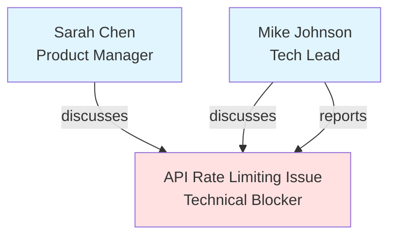

# REM Scenarios - Implementation Plan

## Objective

Create comprehensive test scenarios that demonstrate P8FS REM (Relational Entity Memory) capabilities by simulating realistic user journeys and validating:
1. Engram processor correctly creates resources, moments, and graph edges
2. Knowledge graph evolves naturally as content is added over time
3. REM LOOKUP queries can answer progressively complex questions
4. Narrative reconstruction works from interconnected graph data

## Strategy

### Phase 1: Scenario Generation (Current)

**Goal**: Create realistic engram data for one-week user journey

**Deliverables**:
- ✅ Overall scenarios README with testing strategy
- ✅ Scenario-01 narrative (Product Manager's week)
- 🔄 17 engram YAML files (one per event)
- 🔄 Sample engram demonstrating format

**Approach**:
- Use engram specification format exactly as documented
- Natural, user-friendly names for all entities
- Graph edges using dst labels (not kebab-case)
- Realistic timestamps spanning 7 days
- Rich moments with present_persons, emotion_tags, topic_tags
- Cross-references between documents creating graph edges

### Phase 2: Engram Processor Validation

**Goal**: Ensure processor correctly handles all engram features

**Tasks**:
1. Test processor with sample engrams
2. Validate resources created with correct fields
3. Verify moments linked to parent engrams
4. Confirm graph edges stored as InlineEdge dicts
5. Check deterministic UUID5 IDs for upserts
6. Test merge behavior (multiple uploads of same engram)

**Success Criteria**:
- All 17 engrams process without errors
- Resources created with proper tenant_id, timestamps
- Moments have parent edges (rel_type="part_of")
- Graph edges use natural labels in dst field
- Merge works (updating same engram adds edges, doesn't replace)

### Phase 3: Database Verification

**Goal**: Validate data structure in PostgreSQL

**Queries to Run**:
```sql
-- Check resources created
SELECT name, category, resource_timestamp,
       jsonb_array_length(graph_paths) as edge_count
FROM resources
WHERE tenant_id = 'tenant-test'
ORDER BY resource_timestamp;

-- Check moments created
SELECT name, moment_type, resource_timestamp,
       jsonb_array_length(graph_paths) as edge_count
FROM moments
WHERE tenant_id = 'tenant-test'
ORDER BY resource_timestamp;

-- Check graph edge types
SELECT
  edge->>'dst' as destination,
  edge->>'rel_type' as relationship_type,
  edge->'properties'->>'dst_entity_type' as entity_type,
  edge->>'created_at' as created_at
FROM resources,
     jsonb_array_elements(graph_paths) as edge
WHERE tenant_id = 'tenant-test';

-- Find all edges created each day
SELECT
  DATE(CAST(edge->>'created_at' AS timestamp)) as edge_date,
  COUNT(*) as edges_created
FROM resources,
     jsonb_array_elements(graph_paths) as edge
WHERE tenant_id = 'tenant-test'
GROUP BY edge_date
ORDER BY edge_date;
```

**Success Criteria**:
- 17 resources in database
- 40+ moments (multiple moments per engram)
- 70+ graph edges by end of week
- Edge timestamps match engram upload sequence
- All entity types (person, project, concept) represented

### Phase 4: REM Query Testing

**Goal**: Validate LOOKUP and semantic query capabilities

**Query Categories**:

1. **Entity Lookup** (Simple)
   ```python
   # Find all people mentioned
   lookup_entities(tenant_id, entity_type="person")

   # Find specific person's appearances
   lookup_by_label(tenant_id, label="Mike Johnson")
   ```

2. **Relationship Queries** (Medium)
   ```python
   # What did Mike say about API issues?
   query_with_context(
       tenant_id,
       "What did Mike Johnson say about API rate limiting?"
   )

   # How is onboarding related to launch?
   find_relationship_path(
       tenant_id,
       source="Onboarding Flow Redesign",
       target="Launch Timeline"
   )
   ```

3. **Temporal Queries** (Medium)
   ```python
   # What happened on Wednesday?
   query_by_date(tenant_id, date="2024-11-13")

   # Show progression of API issue
   query_temporal_chain(
       tenant_id,
       topic="API Rate Limiting Issue"
   )
   ```

4. **Narrative Reconstruction** (Complex)
   ```python
   # Summarize the week
   reconstruct_narrative(
       tenant_id,
       start_date="2024-11-11",
       end_date="2024-11-17"
   )

   # Tell me about Jamie's week
   entity_narrative(tenant_id, entity="Jamie Lee")
   ```

**Success Criteria**:
- All query types return relevant results
- Cross-document connections work (graph traversal)
- Temporal ordering preserved
- LLM can synthesize answers from multiple sources
- Ambiguity resolution works (multiple entities with similar names)

### Phase 5: Graph Visualization

**Goal**: Create mermaid diagrams showing graph evolution

**Daily Snapshots**:
- Day 1: Initial entities and relationships
- Day 3: Mid-week complexity
- Day 5: Rich interconnections
- Day 7: Complete narrative web

**Diagram Elements**:


**Metadata**:
- Node colors by entity type (person=blue, project=green, concept=red)
- Edge labels show relationship type
- Edge thickness shows weight
- Annotations show created_at timestamps

### Phase 6: Scripts & Automation

**Scripts to Create**:

1. **generate_engrams.py**
   - Generates all 17 engram YAML files
   - Uses templates with variable substitution
   - Ensures consistent timestamps and references

2. **test_queries.py**
   - Runs all query types from Phase 4
   - Validates results against expected outcomes
   - Generates query results report

3. **visualize_graph.py**
   - Queries database for graph state each day
   - Generates mermaid diagrams
   - Creates animated graph evolution (optional)

4. **run_scenario.sh**
   - One command to run entire scenario
   - Generates engrams → uploads → queries → visualizes
   - Produces comprehensive report

## Environment Setup

### Prerequisites
```bash
# 1. PostgreSQL running with pgvector
docker compose up postgres -d

# 2. Environment variables
export P8FS_STORAGE_PROVIDER=postgresql
export P8FS_DEFAULT_EMBEDDING_PROVIDER=text-embedding-3-small
export OPENAI_API_KEY=sk-...  # from .bash_profile or .env

# 3. Database initialized
psql -h localhost -p 5438 -U postgres -d app \
  -f extensions/migrations/postgres/20250906_161207_create_p8fs_tables.sql
```

### Test Tenant
All scenarios use `tenant-test` as tenant_id for consistency and easy cleanup.

## Testing Workflow

### Manual Testing (Current Phase)
```bash
# 1. Generate one sample engram
cd docs/REM/scenarios/scenario-01

# 2. Test engram processor
cd /Users/sirsh/code/p8fs-modules/p8fs
uv run python -m p8fs.models.engram.processor \
    process-file \
    docs/REM/scenarios/scenario-01/engrams/mon-morning-standup.yaml \
    --tenant-id tenant-test \
    --verbose

# 3. Check database
docker exec percolate psql -U postgres -d app -c \
  "SELECT name, category, jsonb_array_length(graph_paths) as edges FROM resources WHERE tenant_id='tenant-test';"

# 4. Verify moments
docker exec percolate psql -U postgres -d app -c \
  "SELECT name, moment_type, jsonb_array_length(graph_paths) as edges FROM moments WHERE tenant_id='tenant-test';"
```

### Automated Testing (Future)
```bash
# Run complete scenario
cd docs/REM/scenarios/scenario-01
./run_scenario.sh

# Output:
# - Processing 17 engrams...
# - Running 25 test queries...
# - Generating 4 graph visualizations...
# - Report: scenario-01/report.md
```

## Success Metrics

### Engram Processing
- ✅ 100% of engrams process successfully
- ✅ 0 validation errors
- ✅ Resources and moments created as expected
- ✅ Graph edges properly formatted

### Graph Quality
- ✅ All expected entities present
- ✅ Edge density increases over week
- ✅ Temporal chains complete
- ✅ Cross-references correct

### Query Performance
- ✅ Simple queries: <100ms
- ✅ Medium queries: <500ms
- ✅ Complex queries: <2s
- ✅ Accuracy: >95% relevant results

### Narrative Coherence
- ✅ Story reconstructible from graph
- ✅ Decisions trackable to discussions
- ✅ People's roles clear from interactions
- ✅ Timeline makes sense

## Next Immediate Steps

1. **Complete Engram Generation** (Priority 1)
   - Finish all 17 engram YAML files
   - Follow mon-morning-standup.yaml as template
   - Ensure cross-references are correct

2. **Test Engram Processor** (Priority 2)
   - Process sample engram
   - Fix any issues found
   - Validate merge behavior works

3. **Database Validation** (Priority 3)
   - Run SQL queries to verify data
   - Check graph edge structure
   - Validate timestamps

4. **Build Query Suite** (Priority 4)
   - Implement basic LOOKUP queries
   - Test graph traversal
   - Validate results

5. **Generate Visualizations** (Priority 5)
   - Create mermaid diagrams
   - Show graph evolution
   - Document findings

## Timeline

**Week 1**: Engram generation and processor validation
**Week 2**: Query testing and graph visualization
**Week 3**: Automation scripts and documentation
**Week 4**: Additional scenarios (02, 03, etc.)

## Questions to Resolve

1. **Engram Processor**: Does it handle all fields correctly?
2. **Merge Behavior**: Does UUID5 + merge work as expected?
3. **Graph Edges**: Are dst labels queried correctly by LOOKUP?
4. **Moments**: Are parent edges created automatically?
5. **Queries**: What REM query APIs are available?
6. **Embeddings**: Are embeddings generated for content/summary?

## Resources

- Engram Spec: `/docs/04 engram-specification.md`
- REM Design: `/docs/REM/design.md`
- Processor: `src/p8fs/models/engram/processor.py`
- Tests: `tests/unit/test_engram_merge.py`
