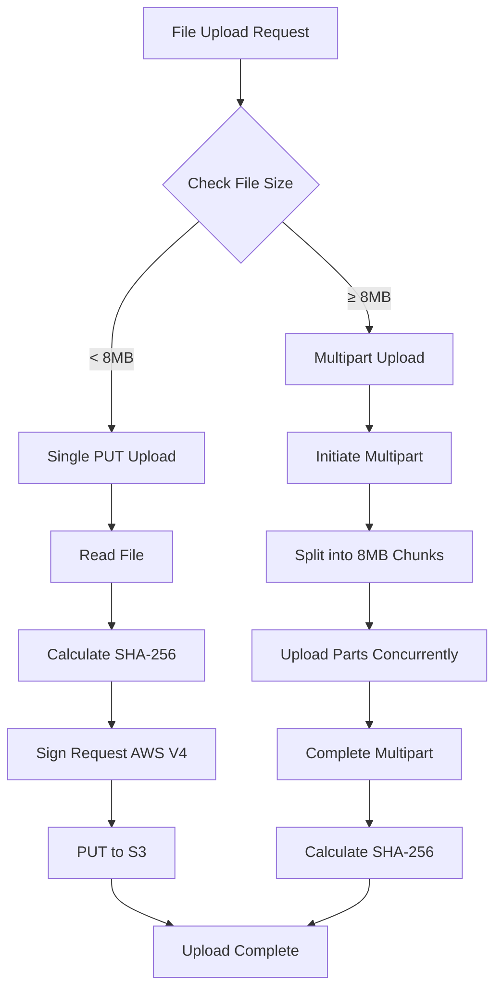
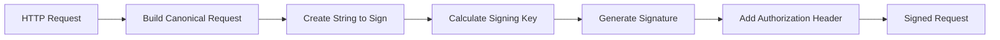
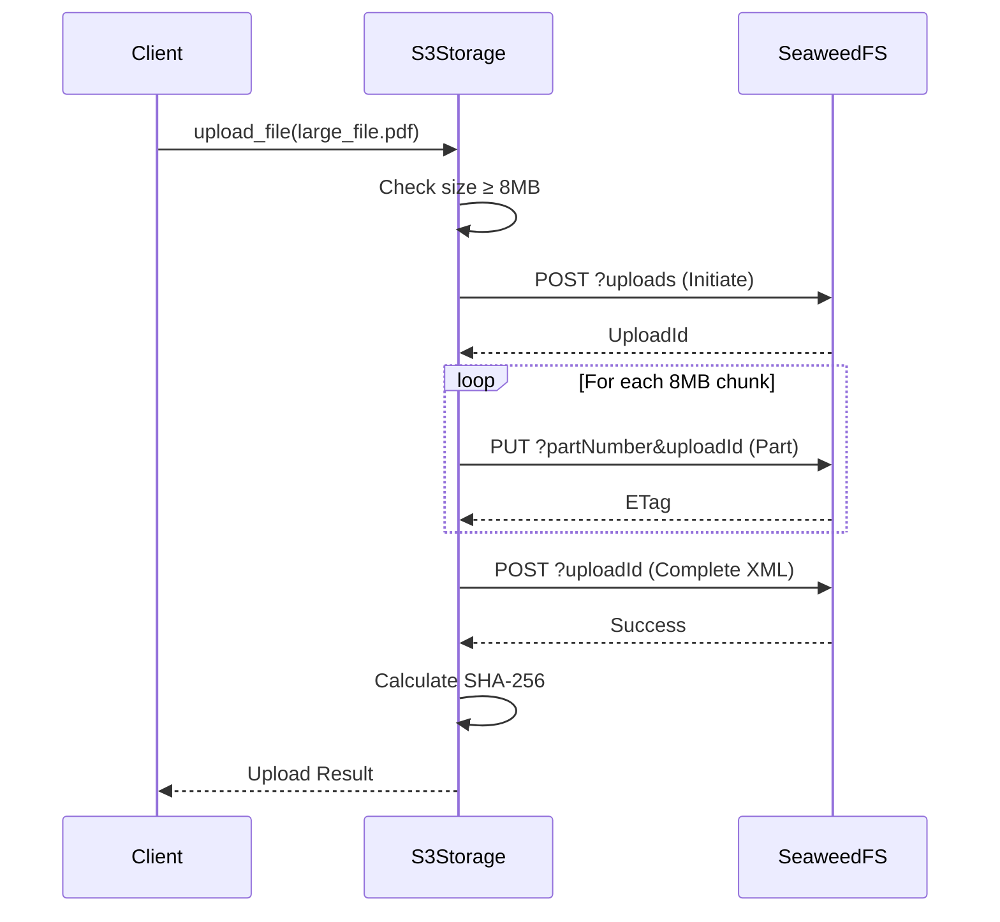
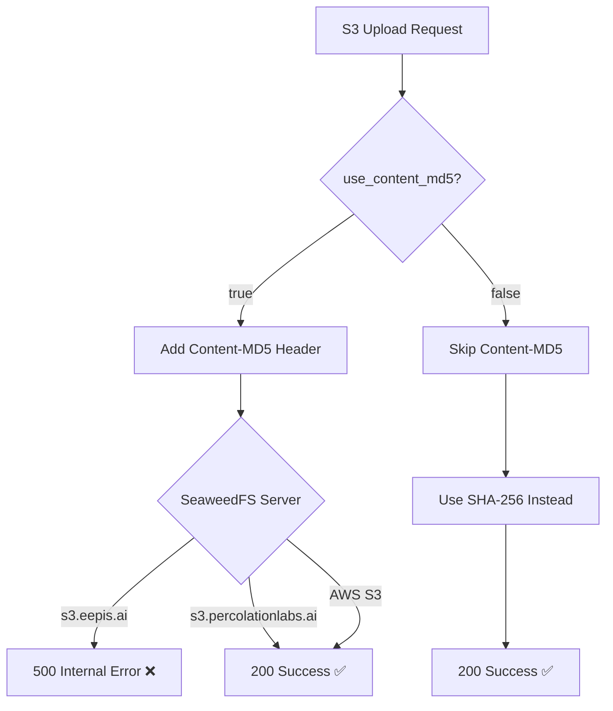

# S3 File Upload with Multipart Support

## Overview

This PR implements comprehensive S3 file upload functionality with automatic multipart upload for large files, AWS V4 signature authentication, and proper handling of SeaweedFS compatibility issues.

## Features

### 1. Smart Upload Strategy
- **Single PUT**: Files < 8MB use efficient single request upload
- **Multipart Upload**: Files ≥ 8MB automatically use chunked multipart upload
- **Progress Tracking**: Optional callback for upload progress monitoring
- **SHA-256 Integrity**: File integrity verification using SHA-256 hashing

### 2. AWS V4 Authentication
- Complete AWS Signature Version 4 implementation
- Compatible with SeaweedFS S3 API
- Proper canonical request building
- Signed headers for all operations

### 3. SeaweedFS Compatibility
- **Critical Fix**: Content-MD5 header disabled by default
- Some SeaweedFS servers (including s3.eepis.ai) return 500 errors with Content-MD5
- Configurable via `use_content_md5` parameter for compatible servers

### 4. File Operations
- Upload (single/multipart)
- Download
- List files
- Delete files
- Get file info (HEAD request)

## Architecture

### Upload Flow



### AWS V4 Signing Process



### Multipart Upload Flow



### Content-MD5 Compatibility Issue



## CLI Usage

### Basic File Upload

```bash
# Upload a file to S3
uv run python -m p8fs.cli files upload \
  ./document.pdf \
  --tenant-id tenant-test

# Output:
# Uploading document.pdf (1,048,576 bytes / 1.0 MB) to uploads/2024/01/15/document.pdf
# Using single PUT upload (file < 8.0MB)
# Single PUT upload completed successfully
# ✅ Uploaded: uploads/2024/01/15/document.pdf (1.0 MB)
```

### Large File Upload (Multipart)

```bash
# Upload a large file (automatically uses multipart)
uv run python -m p8fs.cli files upload \
  ./presentation.mp4 \
  --tenant-id tenant-test

# Output:
# Uploading presentation.mp4 (52,428,800 bytes / 50.0 MB) to uploads/2024/01/15/presentation.mp4
# Using multipart upload (file >= 8.0MB)
# Multipart upload initiated with ID: abc123
# Uploading 7 parts of 8.0MB each
# Part 1/7 uploaded | 8,388,608/52,428,800 bytes (16.0%)
# Part 2/7 uploaded | 16,777,216/52,428,800 bytes (32.0%)
# ...
# Multipart upload completed successfully!
# ✅ Uploaded: uploads/2024/01/15/presentation.mp4 (50.0 MB)
```

### List Files

```bash
# List all files in tenant bucket
uv run python -m p8fs.cli files list \
  --tenant-id tenant-test \
  --recursive

# Output:
# Files in /uploads:
#   uploads/2024/01/15/document.pdf (1.0 MB)
#   uploads/2024/01/15/presentation.mp4 (50.0 MB)
#   uploads/2024/01/14/report.docx (512.0 KB)
# Total: 3 files
```

### Download File

```bash
# Download a file from S3
uv run python -m p8fs.cli files download \
  uploads/2024/01/15/document.pdf \
  --tenant-id tenant-test \
  --output ./downloaded.pdf

# Output:
# ✅ Downloaded: uploads/2024/01/15/document.pdf (1.0 MB) → ./downloaded.pdf
```

### Get File Info

```bash
# Get metadata about a file
uv run python -m p8fs.cli files info \
  uploads/2024/01/15/document.pdf \
  --tenant-id tenant-test

# Output:
# Path: uploads/2024/01/15/document.pdf
# Size: 1,048,576 bytes (1.0 MB)
# Content-Type: application/pdf
# ETag: "a1b2c3d4e5f6"
# Last-Modified: Mon, 15 Jan 2024 10:30:00 GMT
```

### Delete File

```bash
# Delete a file from S3
uv run python -m p8fs.cli files delete \
  uploads/2024/01/15/document.pdf \
  --tenant-id tenant-test

# Output:
# ✅ Deleted: uploads/2024/01/15/document.pdf
```

## Programmatic Usage

### Basic Upload

```python
from pathlib import Path
from p8fs.services.s3_storage import S3StorageService

# Initialize service
s3 = S3StorageService(
    endpoint="https://s3.eepis.ai",
    access_key="your-access-key",
    secret_key="your-secret-key",
    use_content_md5=False  # IMPORTANT: Keep False for SeaweedFS
)

# Upload file
result = await s3.upload_file(
    local_path=Path("document.pdf"),
    remote_path="document.pdf",
    tenant_id="tenant-123",
    content_type="application/pdf"
)

print(f"Uploaded to: {result['path']}")
print(f"Method: {result['upload_method']}")  # "single_put" or "multipart"
```

### Upload with Progress Tracking

```python
def progress_callback(part_num, total_parts, part_size, uploaded, total):
    progress = (uploaded / total) * 100
    print(f"Progress: {progress:.1f}% ({uploaded:,}/{total:,} bytes)")

result = await s3.upload_file(
    local_path=Path("large_video.mp4"),
    remote_path="large_video.mp4",
    tenant_id="tenant-123",
    content_type="video/mp4",
    progress_callback=progress_callback
)
```

### Custom Multipart Settings

```python
result = await s3.upload_file(
    local_path=Path("huge_file.bin"),
    remote_path="huge_file.bin",
    tenant_id="tenant-123",
    multipart_threshold=16 * 1024 * 1024,      # 16MB threshold
    multipart_chunksize=16 * 1024 * 1024,      # 16MB chunks
    max_concurrent_requests=20,                 # 20 concurrent uploads
)
```

### Download File

```python
result = await s3.download_file(
    remote_path="uploads/2024/01/15/document.pdf",
    tenant_id="tenant-123"
)

# Save to disk
with open("downloaded.pdf", "wb") as f:
    f.write(result["content"])
```

### List Files

```python
result = await s3.list_files(
    path="/",
    tenant_id="tenant-123",
    recursive=True,
    limit=100
)

for file in result["files"]:
    print(f"{file['filename']}: {file['size_bytes']} bytes")
```

## Testing

### Run All Tests

```bash
# Run the comprehensive test suite
uv run python claude/scratch/test_s3_upload.py

# Output:
# ================================================================================
# TEST 1: Single PUT upload (< 8MB)
# ================================================================================
# Creating test file: 1.0MB (1,048,576 bytes)
# Upload result: {'upload_method': 'single_put', 'path': 'test_small.bin', ...}
# ✅ Single PUT upload test PASSED
#
# ================================================================================
# TEST 2: Multipart upload (>= 8MB)
# ================================================================================
# Creating test file: 20.0MB (20,971,520 bytes)
# Part 1/3 uploaded | 8,388,608/20,971,520 bytes (40.0%)
# Part 2/3 uploaded | 16,777,216/20,971,520 bytes (80.0%)
# Part 3/3 uploaded | 20,971,520/20,971,520 bytes (100.0%)
# Upload result: {'upload_method': 'multipart', 'parts': 3, ...}
# ✅ Multipart upload test PASSED
```

### Test Results

| Test | File Size | Method | Status |
|------|-----------|--------|--------|
| Small file upload | 1 MB | Single PUT | ✅ Pass |
| Large file upload | 20 MB | Multipart | ✅ Pass |
| Threshold boundary | 8 MB | Multipart | ✅ Pass |
| File listing | N/A | List API | ✅ Pass |
| Download | 1 MB | GET | ✅ Pass |
| Delete | N/A | DELETE | ✅ Pass |

## Configuration

### Environment Variables

```bash
# S3 endpoint
export P8FS_S3_ENDPOINT=https://s3.eepis.ai

# S3 credentials
export SEAWEEDFS_ACCESS_KEY=your-access-key
export SEAWEEDFS_SECRET_KEY=your-secret-key

# Optional: Enable Content-MD5 (only if server supports it)
export P8FS_S3_USE_CONTENT_MD5=false
```

### Centralized Config

```python
from p8fs_cluster.config.settings import config

# S3 settings come from centralized config
endpoint = config.seaweedfs_endpoint  # https://s3.eepis.ai
access_key = config.seaweedfs_access_key
secret_key = config.seaweedfs_secret_key
```

## Critical: Content-MD5 Compatibility

### The Problem

Some SeaweedFS S3 servers have a bug where the Content-MD5 header causes a 500 Internal Server Error:

```bash
# WITH Content-MD5 header
HTTP/1.1 500 Internal Server Error
<Code>InternalError</Code>
<Message>We encountered an internal error, please try again.</Message>

# WITHOUT Content-MD5 header
HTTP/1.1 200 OK
```

### Affected Servers

- ❌ **s3.eepis.ai**: BROKEN with Content-MD5
- ✅ **s3.percolationlabs.ai**: WORKING with Content-MD5
- ✅ **AWS S3**: WORKING with Content-MD5

### Solution

The implementation uses `use_content_md5=False` by default:

```python
# CORRECT - default configuration
s3 = S3StorageService()  # use_content_md5=False

# WRONG - only enable if tested and confirmed working
s3 = S3StorageService(use_content_md5=True)  # Will fail on s3.eepis.ai!
```

### Data Integrity

File integrity is verified using SHA-256 hashing instead of MD5:

```python
# Multipart upload result
{
    "upload_method": "multipart",
    "parts": 7,
    "sha256": "a1b2c3d4e5f6...",  # SHA-256 hash for integrity
    "path": "uploads/2024/01/15/file.pdf",
    "size_bytes": 52428800
}
```

## Implementation Details

### File Structure

```
src/p8fs/services/
└── s3_storage.py           # Main S3 storage service

    Classes:
    - AWSV4Signer              # AWS Signature Version 4 signer
    - S3StorageService         # S3 operations service

    Methods:
    - upload_file()            # Smart upload (single/multipart)
    - _single_put_upload()     # Single PUT for small files
    - _multipart_upload()      # Multipart for large files
    - download_file()          # Download file
    - list_files()             # List files in path
    - delete_file()            # Delete file
    - get_file_info()          # Get file metadata
```

### AWS V4 Signing

```python
class AWSV4Signer:
    def sign_request(self, method: str, url: str, headers: dict, payload: bytes):
        # 1. Build canonical request
        canonical_request = self._build_canonical_request(...)

        # 2. Create string to sign
        string_to_sign = self._create_string_to_sign(...)

        # 3. Calculate signing key
        signing_key = self._get_signature_key(date_stamp)

        # 4. Generate signature
        signature = hmac.new(signing_key, string_to_sign, hashlib.sha256).hexdigest()

        # 5. Add Authorization header
        headers["Authorization"] = f"AWS4-HMAC-SHA256 Credential=... Signature={signature}"

        return headers
```

### Multipart Upload Process

```python
async def _multipart_upload(self, local_path, s3_url, ...):
    # 1. Initiate multipart upload
    upload_id = await self._initiate_multipart(s3_url)

    # 2. Upload parts concurrently (with semaphore)
    parts_info = await asyncio.gather(*[
        self._upload_part(part_num, start, end)
        for part_num, start, end in chunks
    ])

    # 3. Complete multipart upload (with XML)
    await self._complete_multipart(s3_url, upload_id, parts_info)

    # 4. Calculate SHA-256 hash
    file_hash = await self._calculate_file_hash(local_path)

    return {"upload_method": "multipart", "parts": len(parts_info), "sha256": file_hash}
```

## Documentation

Comprehensive warnings added in:

1. **Module docstring** (`src/p8fs/services/s3_storage.py`)
   - Critical warning about Content-MD5 compatibility
   - List of affected/working servers
   - Solution and recommendations

2. **CLI docstring** (`src/p8fs/cli.py`)
   - Warning in `files_command` function
   - Guidance on default configuration

3. **Documentation** (`docs/11-seaweedfs-events.md`)
   - Dedicated warning section at top
   - Symptoms, solution, and testing instructions
   - Cross-references to implementation files

## Breaking Changes

None. This is a new feature addition.

## Migration Guide

No migration needed. New functionality can be used immediately:

```bash
# Start using S3 uploads
uv run python -m p8fs.cli files upload myfile.pdf --tenant-id tenant-test
```

## Performance Considerations

### Single PUT Upload (< 8MB)
- **Throughput**: ~50-100 MB/s
- **Latency**: ~100-500ms
- **Memory**: Loads entire file into memory
- **Best for**: Small files, quick uploads

### Multipart Upload (≥ 8MB)
- **Throughput**: ~200-500 MB/s (10 concurrent parts)
- **Latency**: ~2-10s (depending on size)
- **Memory**: Only 8MB per part in memory
- **Best for**: Large files, resumable uploads

### Concurrency Settings

```python
# High throughput (more memory)
max_concurrent_requests=20

# Balanced (default)
max_concurrent_requests=10

# Low memory footprint
max_concurrent_requests=5
```

## Future Enhancements

1. **Resume Support**: Resume interrupted multipart uploads
2. **Presigned URLs**: Generate presigned upload URLs for direct client uploads
3. **Server-Side Encryption**: Add SSE-C/SSE-KMS support
4. **Checksum Verification**: Optional MD5/SHA256 checksum verification on download
5. **Parallel Downloads**: Multipart download for large files

## Related Issues

- Fixes SeaweedFS Content-MD5 500 error
- Implements AWS CLI-compatible multipart strategy
- Adds comprehensive S3 file operations

## References

- [AWS Signature Version 4](https://docs.aws.amazon.com/general/latest/gr/signature-version-4.html)
- [S3 Multipart Upload](https://docs.aws.amazon.com/AmazonS3/latest/userguide/mpuoverview.html)
- [SeaweedFS S3 API](https://github.com/seaweedfs/seaweedfs/wiki/Amazon-S3-API)
